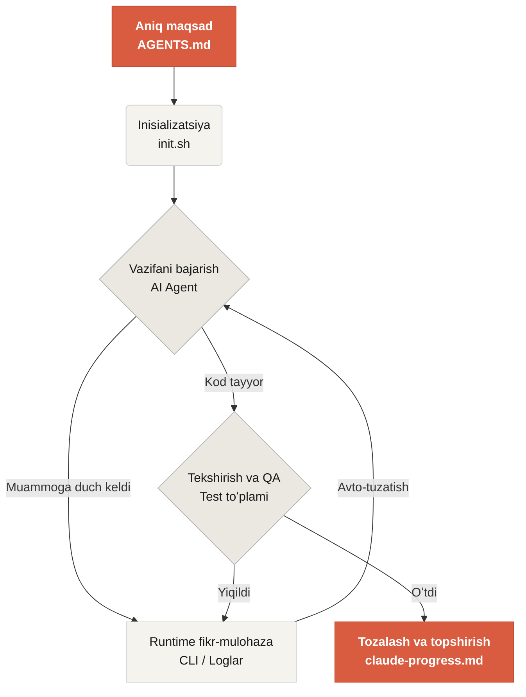

# Harness Engineering kursiga xush kelibsiz

Learn Harness Engineering — sunʼiy intellektga asoslangan kod yozuvchi agentlar muhandisligiga bagʻishlangan kurs. Sanoatdagi eng ilgʻor Harness Engineering nazariyasi va amaliyotini chuqur oʻrganib sintez qildik. Asosiy manbalarimiz:

- [OpenAI: Harness engineering — agent ustuvor dunyoda Codexdan foydalanish](https://openai.com/index/harness-engineering/)
- [Anthropic: Uzoq ishlovchi agentlar uchun samarali harnessʼlar](https://www.anthropic.com/engineering/effective-harnesses-for-long-running-agents)
- [Anthropic: Uzoq muddatli ilova ishlab chiqish uchun harness dizayni](https://www.anthropic.com/engineering/harness-design-long-running-apps)
- [Awesome Harness Engineering](https://github.com/walkinglabs/awesome-harness-engineering)

Tizimli muhit dizayni, holat boshqaruvi, tekshiruv va nazorat tizimlari orqali ushbu kurs sizga Codex va Claude Code kabi agentik kod yozish vositalarini haqiqatan ham ishonchli qilishni oʻrgatadi. AI yordamchingizni aniq qoidalar va chegaralar bilan boshqarib, yangi funksiyalar qoʻshish, xatolarni tuzatish va dasturlash vazifalarini avtomatlashtirishga yordam beradi.

## Boshlash

Oʻqish yoʻlingizni tanlang. Kurs uch qismdan iborat: nazariy maʼruzalar, amaliy loyihalar va tayyor koʻchirib olinadigan resurslar kutubxonasi.

  <a href="./lectures/lecture-01-why-capable-agents-still-fail/" class="card">
    <h3>Maʼruzalar</h3>
    
Kuchli modellar nega hali ham xato qilishini va samarali harness ortidagi nazariyani oʻrganing.

  </a>
  <a href="./projects/" class="card">
    <h3>Loyihalar</h3>
    
Ishonchli agentik muhitni noldan qurish boʻyicha amaliy mashqlar.

  </a>
  <a href="./resources/" class="card">
    <h3>Resurslar kutubxonasi</h3>
    
Oʻz repozitoriyalaringizda foydalanish uchun tayyor andozalar (AGENTS.md, feature_list.json).

  </a>

## Harnessʼning asosiy mexanizmi

Harness modelni “aqlliroq qilmaydi”; aksincha, model uchun yopiq sikldagi **ishchi tizim** oʻrnatadi. Uning ishlash jarayonini quyidagi sodda diagramma orqali tushunish mumkin:

## Nimalarni oʻrganasiz

Mana oʻzlashtiradigan asosiy tushunchalardan baʼzilari:

<ul class="index-list">
  <li><strong>Agent xatti-harakatini cheklash</strong> — aniq qoidalar va chegaralar yordamida.</li>
  <li><strong>Kontekstni saqlash</strong> — uzoq davom etadigan, koʻp sessiyali vazifalar boʻyicha.</li>
  <li><strong>Agentlarni toʻxtatish</strong> — vaqtidan oldin “tugadim” deb eʼlon qilishlarining oldini olish.</li>
  <li><strong>Ishni tekshirish</strong> — toʻliq pipeline testlari va oʻz-oʻzini baholash orqali.</li>
  <li><strong>Runtimeʼni kuzatib borish</strong> va xatolarni topish oson boʻlishi uchun.</li>
</ul>

## Keyingi qadamlar

Asosiy tushunchalarni oʻzlashtirgandan soʻng, quyidagi yoʻriqnomalar yanada chuqurroq kirib borishga yordam beradi:

<ul class="index-list">
  <li><a href="./lectures/lecture-01-why-capable-agents-still-fail/">01-maʼruza: Kuchli agentlar nega hali ham yiqiladi</a> — harness muhandisligi nazariyasidan boshlang.</li>
  <li><a href="./projects/project-01-baseline-vs-minimal-harness/">01-loyiha: Baseline va minimal harness</a> — birinchi haqiqiy vazifani qadamma-qadam koʻrib chiqing.</li>
  <li><a href="./resources/templates/">Andozalar</a> — oʻz loyihalaringiz uchun minimal harness paketini (AGENTS.md, feature_list.json, claude-progress.md) oling.</li>
</ul>
