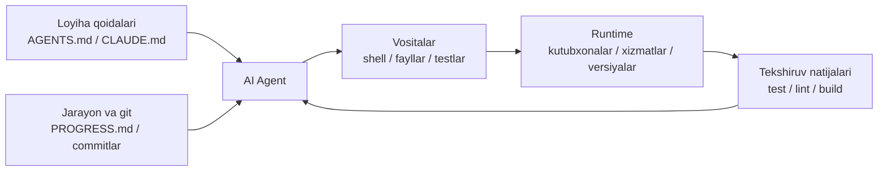

[English version →](../../../en/lectures/lecture-02-what-a-harness-actually-is/)

> Kod misollari: [code/](https://github.com/walkinglabs/learn-harness-engineering/blob/main/docs/en/lectures/lecture-02-what-a-harness-actually-is/code/)
> Amaliy loyiha: [Loyiha 01. Prompt-only vs. rules-first](./../../projects/project-01-baseline-vs-minimal-harness/index.md)

# 2-maʼruza. Harness aslida nima degani

“Harness” soʻzi AI kod yozish agentlari (coding agent) doiralarida koʻp ishlatiladi, lekin ochigʻini aytganda, koʻpchilik odamlar harness deganda “prompt fayli”ni tushunishadi. Bu harness emas. Bu xuddi faqat masalliqlar bilan — plitasiz, pichoqlarsiz, retseptlarsiz, ovqatni taqdim etish (plating) jarayonisiz restoran ochishga oʻxshaydi. Bu restoran emas. Bu muzlatkich.

Ushbu maʼruza sizga harness haqida aniq va amalda qoʻllash mumkin boʻlgan taʼrifni beradi. Bu qandaydir akademik abstraksiya emas, balki siz bugunoq foydalanishingiz mumkin boʻlgan freymvork: harness har birining oʻz vazifalari va baholash mezonlari aniq belgilangan beshta quyi tizimdan iborat.

## Oʻxshatishdan boshlaymiz

Tasavvur qiling, siz hech qanday hujjatlarisiz loyihaga tashlab ketilgan yangi xodim — muhandissiz. README yoʻq, kodda izohlar yoʻq, testlarni qanday yuritishni hech kim aytmaydi, CI konfiguratsiyasi qayerdadir yashiringan. Yaxshi kod yoza olasizmi? Balki — agar yetarlicha aqlli va sabrli boʻlsangiz. Lekin “muammoni hal qilish” oʻrniga “bu loyiha oʻzi nima haqida ekanligini tushunishga” juda koʻp vaqt sarflaysiz.

AI agentlar ham aynan shunday vaziyatga duch keladi. Va bu undan ham yomonroq — siz hech boʻlmasa hamkasbingizdan soʻrashingiz mumkin. Agent faqat siz uning oldiga qoʻygan fayllarni va u ishlata oladigan buyruqlarni koʻra oladi. U kimnidir yelkasiga turtib, “hoy, bu loyiha ORMʼning qaysi versiyasidan foydalanadi?” deb soʻray olmaydi.

OpenAI asosiy tamoyilni “repo — bu spetsifikatsiya (spec)” deb belgilaydi — barcha zarur kontekst repozitoriy ichida, tizimlashtirilgan yoʻriqnoma fayllari, aniq tekshiruv (verification) buyruqlari va tushunarli katalog strukturasi orqali taqdim etilishi kerak. Anthropicʼning koʻp vaqt oladigan (long-running) agentlar hujjatlari holatni saqlash (state persistence), aniq tiklash (recovery) yoʻllari va tizimli jarayon kuzatuviga urgʻu beradi. Ikkala kompaniya ham turli jihatlarga eʼtibor qaratadi, lekin ular aslida bir narsani aytmoqda: **model ogʻirliklaridan (model weights) tashqaridagi barcha muhandislik infratuzilmasi, model imkoniyatlarining (capability) qanchalik roʻyobga chiqishini belgilaydi.**

Oʻzingiz bilgan baʼzi vositalarga eʼtibor qarating:

**Claude Code** harness fikrlash tarzini oʻzida mujassam etadi. U sizning repoʼingizdan `CLAUDE.md` ni oʻqiydi (retseptlar javoni), shell buyruqlarini bajara oladi (pichoqlar tokchasi), sizning lokal muhitingizda (environment) ishlaydi (plita), sessiya tarixini saqlaydi (tayyorgarlik stoli) va testlarni ishga tushirib natijalarni koʻra oladi (sifat nazorati oynasi). Lekin agar siz unga testlarni qanday ishga tushirishni aytmasangiz, sifat nazorati oynasi buzilgan boʻladi — ovqat toʻliq pishgan yoki pishmaganini hech kim bilmaydi.

**Cursor** xuddi shunday mantiqqa amal qiladi. Uning `.cursorrules` fayli bu retseptlar javoni, terminal — pichoqlar tokchasi, plita uchun u loyihangiz strukturasi va lint konfiguratsiyasini oʻqiydi. Lekin Cursorʼning holat boshqaruvi (state management) nisbatan zaif — IDEʼni yopib yana ochsangiz, oldingi kontekst yoʻqoladi.

**Codex** (OpenAIʼning coding agentʼi) har bir vazifaning ishlash muhitini (runtime) alohida ajratish uchun git worktreeʼlardan foydalanadi, bunga qoʻshimcha ravishda lokal kuzatuvchanlik (observability) steki (loglar, metrikalar, treyslar) qoʻshiladi, shu orqali har bir oʻzgarish mustaqil muhitda tekshiriladi. `AGENTS.md` va aniq tekshiruv buyruqlari mavjud repoʼlarda, u qoʻshimcha tuzilmasiz muhitlarga (bare environments) qaraganda ancha yaxshi ishlaydi.

**AutoGPT** ogohlantiruvchi misoldir — tizimli holat boshqaruvining yoʻqligi, uzoq davom etadigan vazifalarda kontekstning toʻplanib qolishiga olib keladi, aniq tekshiruv qayta aloqasi (verification feedback) mexanizmlarining yoʻqligi esa agentʼning siklga (loop) tushib qolishiga sabab boʻladi. Koʻpchilik odamlar AutoGPT “ishlamaydi” deyishadi, lekin aslida bu ishlamaydigan AutoGPTʼning harnessʼidir — oshpazga buzuq plita bersangiz, hatto eng yaxshi masalliqlar bilan ham ovqat pishira olmaydi.

## Asosiy tushunchalar

- **Harness nima**: Model ogʻirliklaridan tashqaridagi barcha muhandislik infratuzilmasi. OpenAI muhandisning asosiy vazifasini uch narsaga qisqartiradi: muhitlarni loyihalash, niyatni ifodalash va qayta aloqa sikllarini (feedback loops) qurish. Anthropic oʻzining Claude Agent SDKʼsini “umumiy maqsadli agent harnessʼi” deb ataydi.
- **Repo — bu yagona haqiqat manbai (system of record)**: Agent koʻra olmaydigan har qanday narsa, amalda mavjud emas deb hisoblanadi. OpenAI repoʼni “yagona haqiqat manbai” (system of record) sifatida qabul qiladi — barcha zarur kontekst tizimlashtirilgan fayllar va tushunarli katalog strukturasi orqali shu yerda yashashi kerak.
- **Qoʻllanma emas, xarita bering**: OpenAI tajribasidan — `AGENTS.md` ensiklopediya emas, balki katalog sahifasi boʻlishi kerak. Taxminan 100 qator yetarli. Agar sigʻmasa, uni `docs/` katalogiga ajrating va kerak boʻlganda agent oʻqishiga imkon bering.
- **Cheklang, mikromenejment qilmang**: Yaxshi harness yoʻriqnomalarni birma-bir sanab oʻtish oʻrniga, agentʼni cheklash uchun bajariladigan qoidalardan (executable rules) foydalanadi. OpenAI “implementatsiyani mikromenejment qilmang, oʻzgarmas qoidalarni (invariants) taʼminlang” deydi; Anthropic shuni aniqladiki, agentlar oʻz ishlarini ishonch bilan maqtashadi va buning yechimi “ishni bajaradigan odam” bilan “ishni tekshiradigan odam”ni alohida ajratishdir.
- **Komponentlarni birma-bir olib tashlang**: Har bir harness komponentining qadrini oʻlchash uchun, ularni birma-bir olib tashlang va qaysi birining olib tashlanishi unumdorlikning eng katta pasayishiga olib kelishini koʻring. Anthropic bu usuldan foydalandi va shuni aniqladiki, modelʼlar kuchayib borgan sari baʼzi komponentlar oʻzining oʻta muhimligini yoʻqotadi — lekin doim yangilari paydo boʻladi.

## Beshta quyi tizimli Harness modeli

Oshxona analogiyasiga qaytamiz. Toʻliq oshxonada beshta funksional hudud mavjud, harness ham beshta quyi tizimga ega:



**Yoʻriqnomalar quyi tizimi (retseptlar javoni)**: Loyihaning umumiy koʻrinishi va maqsadi (bir jumlada), tech stack va uning versiyalari (Python 3.11, FastAPI 0.100+, PostgreSQL 15), birinchi marta ishga tushirish buyruqlari (`make setup`, `make test`), muhokama qilinmaydigan qatʼiy cheklovlar (“Barcha APIʼlar OAuth 2.0ʼdan foydalanishi shart”) va batafsilroq hujjatlarga havolalarni oʻz ichiga olgan `AGENTS.md` (yoki `CLAUDE.md`) faylini yarating.

**Vosita quyi tizimi (pichoqlar tokchasi)**: Agent yetarli vositalardan foydalanish huquqiga ega ekanligiga ishonch hosil qiling. “Xavfsizlik” deb shellʼni oʻchirib qoʻymang — agar agent hatto `pip install` qila olmasa, qanday ishlashi mumkin? Lekin hamma narsani ham ochib yubormang — eng kam imtiyoz (least-privilege) tamoyiliga amal qiling.

**Muhit quyi tizimi (plita)**: Muhit holati (environment state) oʻz-oʻzini izohlaydigan boʻlishini taʼminlang. Bogʻliqliklarni (dependencies) qulflash uchun `pyproject.toml` yoki `package.json`, runtime versiyalari uchun `.nvmrc` yoki `.python-version`, va har doim bir xil natija olish (reproducibility) uchun Docker yoki devcontainerʼlardan foydalaning.

**Holat quyi tizimi (tayyorgarlik stoli)**: Uzoq davom etadigan vazifalar jarayonni kuzatib borishni talab qiladi. Oddiy `PROGRESS.md` faylidan foydalanib quyidagilarni yozib boring: nima tugatildi, nima jarayonda, nimaga toʻsqinlik qilinmoqda. Har bir sessiya tugashidan oldin uni yangilang va keyingi sessiya boshlanganda uni oʻqing.

**Qayta aloqa quyi tizimi (sifat nazorati oynasi)**: Bu eng yuqori ROIʼga ega quyi tizimdir. Tekshiruv (verification) buyruqlarini `AGENTS.md` faylida aniq koʻrsating:
```text
Tekshiruv buyruqlari:
- Testlar: pytest tests/ -x
- Type check: mypy src/ --strict
- Lint: ruff check src/
- Toʻliq tekshiruv: make check (yuqoridagilarning barchasini oʻz ichiga oladi)
```

Qandaydir bir quyi tizimning yoʻqligi, xuddi oshxonada qaysidir funksional hududning yoʻqligiga oʻxshaydi — siz hali ham ovqat pishirishingiz mumkin, lekin bu doim noqulay boʻladi.

**Harness sifatini tashxis qilish**: **Izometrik model boshqaruvi** (modelni oʻzgarmas saqlab, harness komponentlarini birma-bir olib tashlab tekshirish usuli)dan foydalaning. Modelni oʻzgarishsiz qoldiring, quyi tizimlarni birma-bir olib tashlang, qaysi birining olib tashlanishi unumdorlikning eng katta pasayishiga olib kelishini oʻlchang. Bu sizning toʻsiq nuqtangiz (bottleneck) — asosiy eʼtiboringizni shu yerga qarating. Xuddi oshxonadagi toʻsiqni topishga oʻxshaydi: retseptlar javonini olib tashlang va ishlar qanchalik sekinlashishini koʻring, plitani oʻchiring va uning taʼsirini kuzating.

## Jamoaning hayotiy misoli

Bir jamoa TypeScript + React asosidagi frontend ilovasida (~20,000 qator kod) GPT-4oʼdan foydalandi. Ular toʻrtta bosqichdan oʻtishdi — aslini olganda oshxona jihozlarini birma-bir qoʻshib chiqishdi:

**1-bosqich — Boʻsh oshxona**: Faqat READMEʼda loyihaning qisqacha tavsifi mavjud. 5 ta sinovdan 1 tasi muvaffaqiyatli oʻtdi (20%). Asosiy muvaffaqiyatsizliklar: notoʻgʻri paket menejerini tanladi (npm yoki yarn), komponentlarni nomlash konvensiyalariga amal qilmadi, testlarni ishga tushira olmadi.

**2-bosqich — Retseptlar javoni oʻrnatildi**: Tech stack versiyalari, nomlash konvensiyalari va asosiy arxitektura qarorlari kiritilgan `AGENTS.md` fayli qoʻshildi. Muvaffaqiyat koʻrsatkichi 60% ga koʻtarildi. Qolgan muvaffaqiyatsizliklar asosan muhitdagi muammolar va tekshiruvning yoʻqligi bilan bogʻliq edi.

**3-bosqich — Sifat nazorati oynasi ochildi**: `AGENTS.md` faylida tekshiruv buyruqlari koʻrsatildi: `yarn test && yarn lint && yarn build`. Muvaffaqiyat koʻrsatkichi 80% ga koʻtarildi.

**4-bosqich — Tayyorgarlik stoli tayyor**: Agentlar har bir sinovda tugatilgan va chala ishlarni yozib boradigan jarayon fayli andozalari (progress file templates) joriy etildi. Muvaffaqiyat koʻrsatkichi 80-100% atrofida barqarorlashdi.

Toʻrtta iteratsiya, model umuman oʻzgarmadi, muvaffaqiyat koʻrsatkichi 20% dan deyarli 100% gacha koʻtarildi. Harness muhandisligining kuchi mana shunda. Siz qimmatroq masalliqlar sotib olmadingiz — shunchaki oshxonani toʻgʻri tartibga keltirdingiz.

## Asosiy xulosalar

- Harness = Yoʻriqnomalar + Vositalar + Muhit + Holat + Qayta aloqa. Beshta quyi tizim, xuddi oshxonaning beshta funksional hududiga oʻxshab — barchasi zarur.
- Agar bu model ogʻirliklari boʻlmasa, bu harness. Sizning harnessʼingiz model imkoniyatlarining qanchalik roʻyobga chiqishini belgilaydi.
- Beshta quyi tizim ichida qayta aloqa quyi tizimi odatda eng kam xarajat va eng yuqori daromadga (ROI) ega. Avval tekshiruv buyruqlaringizni toʻgʻri sozlang — sifat nazorati oynasi eng munosib yangilanishdir.
- Har bir quyi tizimning hissasini oʻlchash uchun **izometrik model boshqaruvi**dan foydalaning — ichki sezgiga suyanmang.
- Harness xuddi kod kabi eskiradi. Uni muntazam tekshirib turing, texnik qarzni toʻlaganingiz kabi harness qarzini ham toʻlab boring.

## Qoʻshimcha oʻqish uchun

- [OpenAI: Harness Engineering](https://openai.com/index/harness-engineering/)
- [Anthropic: Effective Harnesses for Long-Running Agents](https://www.anthropic.com/engineering/effective-harnesses-for-long-running-agents)
- [HumanLayer: Harness Engineering for Coding Agents](https://humanlayer.dev/articles/harness-engineering-for-coding-agents/)
- [SWE-agent: Agent-Computer Interfaces](https://github.com/princeton-nlp/SWE-agent)
- [Thoughtworks: Harness Engineering on Technology Radar](https://www.thoughtworks.com/radar)

## Mashqlar

1. **Beshta quyi tizimli harness auditi**: Siz AI agentʼidan foydalanadigan bitta loyihani oling va beshta quyi tizimli freymvorkdan foydalanib toʻliq audit qiling. Har bir quyi tizimni 1 dan 5 gacha baholang. Eng past baholangan quyi tizimni toping, uni yaxshilashga 30 daqiqa sarflang, soʻngra agent unumdorligidagi oʻzgarishni kuzating.

2. **Izometrik model boshqaruvi tajribasi**: Bitta model va bitta murakkab vazifani tanlang. Ketma-ket yoʻriqnomalarni olib tashlang (`AGENTS.md` ni oʻchiring), qayta aloqani olib tashlang (tekshiruv buyruqlarini bermang), holatni olib tashlang (jarayon fayllari yoʻq) — faqat bittasini olib tashlang va unumdorlikning qanchalik tushishini oʻlchang. Natijalarga asoslanib, loyihangiz uchun quyi tizimlarni muhimlik darajasiga koʻra tartiblang.

3. **Imkoniyatlar tahlili (Affordance analysis)**: Loyihangizdagi agent “nimadir qilishni xohlaydigan, lekin qila olmaydigan” vaziyatni toping (masalan, parametrlangan (parameterized) soʻrovlardan foydalanish kerakligini biladi, lekin loyihangizning ORM andozalarini (patterns) bilmaydi). Bu bajarish boʻshligʻi (Gulf of Execution — qanday qilishni bilmaydi) yoki baholash boʻshligʻi (Gulf of Evaluation — toʻgʻri yoki yoʻqligini bilmaydi) ekanligini tahlil qiling, soʻngra uni toʻldirish uchun harnessʼni yaxshilash rejasini tuzing.
