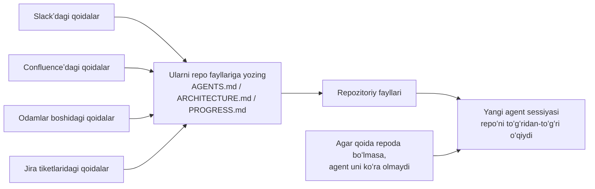
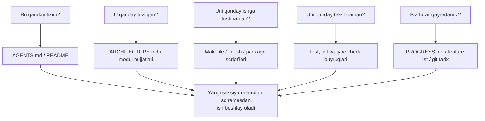

[English version →](../../../en/lectures/lecture-03-why-the-repository-must-become-the-system-of-record/)

> Kod misollari: [code/](https://github.com/walkinglabs/learn-harness-engineering/blob/main/docs/en/lectures/lecture-03-why-the-repository-must-become-the-system-of-record/code/)
> Amaliy loyiha: [Loyiha 02. Agent oʻqiy oladigan ish maydoni](./../../projects/project-02-agent-readable-workspace/index.md)

# 3-maʼruza. Repozitoriyni yagona haqiqat manbaiga aylantiring

Jamoangizning arxitektura qarorlari Confluence, Slack, Jira va bir nechta tajribali muhandislarning boshida tarqalib ketgan. Odamlar uchun bu amallab ishlaydi — siz hamkasbingizdan soʻrashingiz, chat tarixini qidirishingiz, hujjatlarni titkilab chiqishingiz mumkin. Agar boshqa hech narsa yordam bermasa, tanaffus xonasida kimnidir burchakka taqab soʻrab olasiz. Lekin AI agent uchun repozitoriyda mavjud boʻlmagan maʼlumot shunchaki yoʻq degani.

Bu mubolagʻa emas. Agentʼning kiruvchi maʼlumotlari (inputs) aslida nima ekanligini oʻylab koʻring: system promptʼlar va vazifa tavsiflari, repozitoriydagi fayllar tarkibi va vositalardan chiqqan natijalar. Bori shu. Sizning Slack tarixingiz, Jira tiketlari, Confluence sahifalari va juma kuni tushdan keyin qahva ustida hamkasbingiz bilan muhokama qilgan arxitektura qaroringiz — bularning birortasini agent koʻra olmaydi. U “borib birovdan soʻray” yoki “chat tarixini qidiray” deya olmaydi. U repozitoriy ichiga qamab qoʻyilgan muhandisdir — undan tashqaridagi barcha narsalar haqida u hech narsani bilmaydi.

Shuning uchun savol shunday qoʻyiladi: bu muhandisga yaxshi xarita berasizmi?

## Xaritada nimalar boʻlishi kerak

OpenAI buni ochiqchasiga aytadi: **repoda yoʻq boʻlgan maʼlumot agent uchun yoʻqdir.** Ular buni “repo spetsifikatsiya sifatida (repo as spec)” tamoyili deb atashadi — repozitoriyning oʻzi eng yuqori vakolatli spetsifikatsiya hujjatidir.

Anthropicʼning uzoq muddatli ishlovchi agentlar (long-running agents) hujjatlari ham buni tasdiqlaydi: holatni doimiy saqlash (persistent state) uzoq muddatli vazifalar davomiyligi uchun zarur shartdir. Sessiyalararo bilimlarni tiklash qobiliyati bevosita vazifalarning muvaffaqiyat koʻrsatkichini belgilaydi. Va bu holat repozitoriyda boʻlishi shart — chunki u agent ega boʻlgan yagona barqaror va ochiq xotiradir.

Siz shunday oʻylashingiz mumkin: “Jamoamiz kichik, bilimlar hammaning boshida va bu muammosiz ishlayapti.” Toʻgʻri, odamlar uchun. Lekin agar siz agentʼdan foydalanayotgan boʻlsangiz, shu faktni qabul qiling: agent odamlardan soʻray olmaydi. U bilishi kerak boʻlgan hamma narsa yozilgan va u topa oladigan joyda saqlangan boʻlishi shart.

Bu “koʻproq hujjat yozish” haqida emas. Bu “qaror qabul qilish maʼlumotlarini toʻgʻri joyga qoʻyish” haqida. `src/api/` katalogidagi 50 qatorlik `ARCHITECTURE.md` fayli, hech kim qaramaydigan Confluenceʼdagi 500 sahifalik dizayn hujjatidan oʻn ming marta foydaliroqdir. Bu xuddi stolingizga yopishtirib qoʻyilgan qoʻlda chizilgan ofis xaritasi bilan javonga qulflab qoʻyilgan ajoyib arxitektura chizmasini taqqoslashdek gap — birinchisi kerak boʻlganda yoningizda turadi, ikkinchisi esa texnik jihatdan mukammal boʻlsa-da, kerakli paytda foydasizdir.

## Bilim koʻrinuvchanligi (Knowledge Visibility)



Xaritangiz yetarlicha yaxshi yoki yoʻqligini qanday sinab koʻrasiz? “Sovuq ishga tushirish (cold-start)” testini oʻtkazing: faqat repo tarkibidan foydalanadigan butunlay yangi agent sessiyasini oching va uning beshta asosiy savolga javob bera olishini tekshiring:



Agar u javob bera olmasa, xaritada boʻsh joylar (blank spots) mavjud. Xarita boʻsh boʻlgan joyda agent taxmin qiladi — xato taxminlar bugʼlarga aylanadi, ortiqcha taxminlar esa kontekstni bekorga sarflaydi. Va har bir yangi sessiya hamma narsani boshidan taxmin qilishga majbur. Taxmin qilishning narxi, xaritani boshidanoq toʻgʻri chizib qoʻyish narxidan doim yuqori boʻladi.

## Asosiy tushunchalar

- **Bilim koʻrinuvchanligi boʻshligʻi (Knowledge Visibility Gap)**: Loyiha boʻyicha umumiy bilimlarning repozitoriyda MAVJUD BOʻLMAGAN qismi. Boʻshliq qanchalik katta boʻlsa, agentʼning muvaffaqiyatsizlik koʻrsatkichi shuncha yuqori boʻladi. Bu loyiha haqidagi qancha yashirin bilimlar sizning boshingizda saqlanadi? Hammasini hisoblab chiqing va qanchasi repoga kiritilganini koʻring — farq sizning koʻrinuvchanlik boʻshligʻingizdir.
- **Yagona haqiqat manbai (System of Record)**: Loyiha qarorlari, arxitektura cheklovlari, bajarilish holati va tekshiruv (verification) standartlari uchun vakolatli manba sifatida kod repozitoriysi olinadi. Repo oxirgi soʻzni aytadi, boshqa hech qayer hisobga olinmaydi. Xuddi xaritada “yoʻl yopiq” belgisi qoʻyilganidek — siz u yoʻldan yurmaysiz. Lekin agar bu maʼlumot faqat Qari Zhangʻning boshida boʻlsa, har safar borib undan soʻrashingizga toʻgʻri keladi.
- **Sovuq ishga tushirish testi (Cold-Start Test)**: Yuqoridagi beshta savol. U qanchasiga javob bera olsa, xaritangiz shunchalik toʻliq boʻladi.
- **Kashfiyot narxi (Discovery Cost)**: Agent repoda bitta muhim maʼlumotni topish uchun qancha kontekst byudjetini sarflashi. Maʼlumot qanchalik yashiringan boʻlsa, kashfiyot narxi shunchalik yuqori boʻladi va asosiy vazifa uchun shuncha kam byudjet qoladi. Muhim maʼlumotlarni 10 ta katalog chuqurligidagi README ichiga yashirish — bu xuddi oʻt oʻchirgichni yertoʻladagi seyfga qulflab qoʻyishga oʻxshaydi; u mavjud, lekin kerak boʻlganda topa olmaysiz.
- **Bilim eskirish darajasi (Knowledge Decay Rate)**: Vaqt oʻtishi bilan eskiradigan bilimlar ulushi. Hujjatlarning kod bilan mos kelmay qolishi eng katta dushmandir — bu hujjat umuman yoʻqligidan ham yomonroq.
- **ACID analogiyasi**: Maʼlumotlar bazasi tranzaksiyasi tamoyillarini (Atomicity, Consistency, Isolation, Durability) agent holatini boshqarishga qoʻllash. Buni quyida batafsil yoritamiz.

## Yaxshi xarita qanday chiziladi

**1-tamoyil: Bilim kodning yonida yashaydi.** API endpoint autentifikatsiyasi haqidagi qoida qandaydir katta global hujjatning ichida yashirinmasdan, API kodining yonida turishi kerak. Har bir modul katalogida uning vazifalari, interfeyslari va maxsus cheklovlarini tushuntiruvchi qisqa hujjat joylashtiring. Xuddi kutubxona tokchalaridagi yorliqlar kabi — tarix kitoblari kerakmi, toʻgʻridan-toʻgʻri “Tarix” deb yozilgan tokchaga borasiz. Butun kutubxonani qidirishga hojat yoʻq.

**2-tamoyil: Standartlashtirilgan kirish faylidan foydalaning.** `AGENTS.md` (yoki `CLAUDE.md`) bu agentʼning “kirish sahifasi” (landing page). U barcha maʼlumotlarni oʻz ichiga olishi shart emas, lekin u agentʼga uchta savolga tezda javob topish imkonini berishi kerak: “Bu nima loyiha”, “Uni qanday ishga tushiraman” va “Uni qanday tekshiraman”. 50-100 qator yetarli.

**3-tamoyil: Minimal, lekin toʻliq.** Har bir bilim parchasining aniq foydalanish holati boʻlishi kerak. Agar qoidani olib tashlash agentʼning qaror qabul qilish sifatiga taʼsir qilmasa, u qoida mavjud boʻlmasligi kerak. Biroq, sovuq ishga tushirish testidagi har bir savolning javobi boʻlishi shart. Bu nozik muvozanat — juda koʻp emas, juda kam ham emas, ayni meʼyorida.

**4-tamoyil: Kod bilan birga yangilang.** Bilimlar yangilanishini kod oʻzgarishlariga bogʻlang. Eng oddiy usul: arxitektura hujjatlarini tegishli modul katalogiga qoʻying. Kodni oʻzgartirganingizda, oʻz-oʻzidan hujjatni koʻrasiz. Kod oʻzgarishlaridan keyin, CI hujjatlarni yangilash kerak yoki yoʻqligini tekshirishni eslatib turishi mumkin.

**Aniq repo strukturasi**:

```
project/
├── AGENTS.md              # Kirish: loyiha tavsifi, ishga tushirish buyruqlari, qatʼiy cheklovlar
├── src/
│   ├── api/
│   │   ├── ARCHITECTURE.md  # API qatlami arxitekturasi qarorlari
│   │   └── ...
│   ├── db/
│   │   ├── CONSTRAINTS.md   # Maʼlumotlar bazasi amallari uchun qatʼiy cheklovlar
│   │   └── ...
│   └── ...
├── PROGRESS.md             # Joriy jarayon: tugatilgan, jarayonda, bloklangan
└── Makefile                # Standart buyruqlar: setup, test, lint, check
```

## ACID tamoyillari bilan Agent holatini boshqarish

Bu analogiya maʼlumotlar bazasi tranzaksiyalarini boshqarishdan olingan — ehtimol, siz buni narsalarni ortiqcha murakkablashtirish deb oʻylashingiz mumkin, lekin u aslida sizga juda amaliy freymvorkni beradi:

- **Atomicity (Boʻlinmaslik)**: Har bir “mantiqiy amal” (masalan, “yangi endpoint qoʻshish va testlarni yangilash”) uchun bitta git commit qilinadi. Agar oʻrtada xatolik yuz bersa, orqaga qaytarish uchun `git stash` ishlatiladi. Yoki hammasi, yoki hech narsa — “yarmi bajarildi” degan narsa yoʻq.
- **Consistency (Muvofiqlik)**: “Muvofiq holat”ni (consistent state) tekshirish mezonlarini belgilang — barcha testlar oʻtadi, lint xatosi nolga teng. Agent har bir amaldan keyin tekshiruvni ishga tushiradi; muvofiq boʻlmagan oraliq holatlar commit qilinmaydi. Xuddi bank oʻtkazmasi kabi — mablagʻ kiritilmasdan turib yechib olinmaydi.
- **Isolation (Izolyatsiya)**: Bir nechta agentlar parallel ishlaganda, poyga holatlarini (race conditions) oldini olish uchun holat fayllarini (state files) toʻgʻri loyihalang. Oddiy usul: har bir agent oʻzining alohida progress faylidan foydalanadi yoki izolyatsiya uchun git branchʼlaridan foydalaning. Ikkita oshpaz bitta qozonga bir vaqtda ziravor sola olmaydi — ovqat shoʻr boʻlib ketsa, kim javob beradi?
- **Durability (Chidamlilik)**: Loyihaning muhim bilimlari git orqali kuzatiladigan fayllarda saqlanadi. Vaqtinchalik holat sessiya xotirasida qolishi mumkin, ammo sessiyalararo bilimlar fayllarda doimiy saqlanishi kerak. Sizning boshingizda nima borligi muhim emas — faqat qogʻozda bor narsa hisobga olinadi.

## Haqiqiy oʻzgarish hikoyasi

Bir jamoa ~30 ta mikroservisga ega e-tijorat platformasini boshqargan. Arxitektura qarorlari (servislararo aloqa protokollari, maʼlumotlar muvofiqligi strategiyalari, API versiyalash qoidalari) quyidagilarda tarqalib ketgan edi: Confluence (qisman eskirgan), Slack (qidirish qiyin), bir nechta tajribali muhandislarning boshlarida (kengaytirib boʻlmaydi) va kod izohlarida tarqoq holda (tizimli emas).

AI agentlarini joriy etgandan soʻng, vazifalarning 70% inson aralashuvini talab qildi. Deyarli har bir muvaffaqiyatsizlik agentning “hamma biladi, lekin hech kim yozmagan” yashirin cheklovni buzishi bilan bogʻliq edi. Bu xuddi yangi xodimga hech kim “tushlik buyurtmasini guruh chatiga yozishing kerak” deb aytmaganiga oʻxshaydi — ular xato qilishadi, dakki eshitishadi, ammo gap eshitganidan keyin ham hech kim ularga qoidani tushuntirmaydi.

Jamoa oʻzgarishlarni amalga oshirdi:
1. Repo ildizida loyiha tavsifi, tech stack versiyalari va global qatʼiy cheklovlar kiritilgan `AGENTS.md` fayli yaratildi.
2. Har bir mikroservis katalogida uning vazifalari, interfeyslari va bogʻliqliklarini taʼriflovchi `ARCHITECTURE.md` qoʻshildi.
3. Aniq “SHART/MUMKIN EMAS” tili bilan markazlashgan qatʼiy cheklovlar (`CONSTRAINTS.md`) yaratildi.
4. Har bir servis katalogiga joriy ish holatini kuzatuvchi `PROGRESS.md` qoʻshildi.

Oʻzgarishlardan soʻng: xuddi shu agent sovuq ishga tushirishda barcha asosiy loyiha savollariga javob bera oldi va vazifani yakunlash sifati sezilarli darajada yaxshilandi.

## Asosiy xulosalar

- Repoda boʻlmagan bilim agent uchun mavjud emas. Muhim qarorlarni repoga kiritish eng asosiy harness sarmoyasidir — adashib qolmaslik uchun yaxshi xarita chizing.
- Repo sifatini baholash uchun “sovuq ishga tushirish testi”dan foydalaning: yangi sessiya faqat repo tarkibidan foydalanib beshta asosiy savolga javob bera oladimi?
- Bilim kodning yonida, minimal lekin toʻliq boʻlishi, va kod bilan birga yangilanishi kerak. Bu koʻproq hujjat yozish emas — maʼlumotni toʻgʻri joyga qoʻyish demakdir.
- Agent holati uchun ACID tamoyillaridan foydalaning: boʻlinmas (atomic) commitʼlar, muvofiqlikni (consistency) tekshirish, parallel ishlash izolyatsiyasi, doimiy muhim bilimlar.
- Bilim eskirishi eng katta dushmandir. Kodga mos kelmaydigan hujjat hujjat umuman yoʻqligidan xavfliroq — u agentni oʻzini toʻgʻri qilyapman deb oʻylab notoʻgʻri yoʻnalishga boshlaydi.

## Qoʻshimcha oʻqish uchun

- [OpenAI: Harness Engineering](https://openai.com/index/harness-engineering/)
- [Anthropic: Effective Harnesses for Long-Running Agents](https://www.anthropic.com/engineering/effective-harnesses-for-long-running-agents)
- [Infrastructure as Code — Martin Fowler](https://martinfowler.com/bliki/InfrastructureAsCode.html)
- [ADR: Architecture Decision Records](https://adr.github.io/)
- [The Twelve-Factor App](https://12factor.net/)

## Mashqlar

1. **Sovuq ishga tushirish testi**: Loyihangizda mutlaqo yangi agent sessiyasini oching (ogʻzaki kontekstsiz, faqat repo tarkibi bilan). Undan beshta savol soʻrang: Bu qanday tizim? U qanday tuzilgan? Uni qanday ishga tushiraman? Uni qanday tekshiraman? Joriy jarayon qanday? U qaysi savollarga javob bera olmasligini qayd eting va u javob bera olmagunicha repoʻni yaxshilang.

2. **Bilimlarni tashqariga chiqarishni hisoblash**: Loyihangizda ishlab chiqish uchun muhim boʻlgan barcha qarorlar va cheklovlarni roʻyxatga oling. Ularning har birini repo ichida yoki tashqarisida deb belgilang. Bilim koʻrinuvchanligi boʻshligʻingizni (repo tashqarisidagi ulushni) hisoblang. Uni 10% dan kamaytirish uchun reja tuzing.

3. **ACID baholash**: Loyihangizdagi holat boshqaruvini ushbu maʼruzadagi ACID analogiyasidan foydalanib baholang. Atomicity — agent amallarini toza orqaga qaytarish mumkinmi? Consistency — “muvofiq holat”ni tekshirish bormi? Isolation — parallel ishlayotgan agentlar bir-biriga xalaqit bermaydimi? Durability — barcha sessiyalararo bilimlar fayllarga doimiy saqlanganmi?
