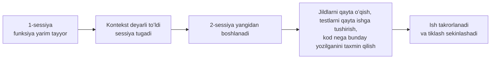
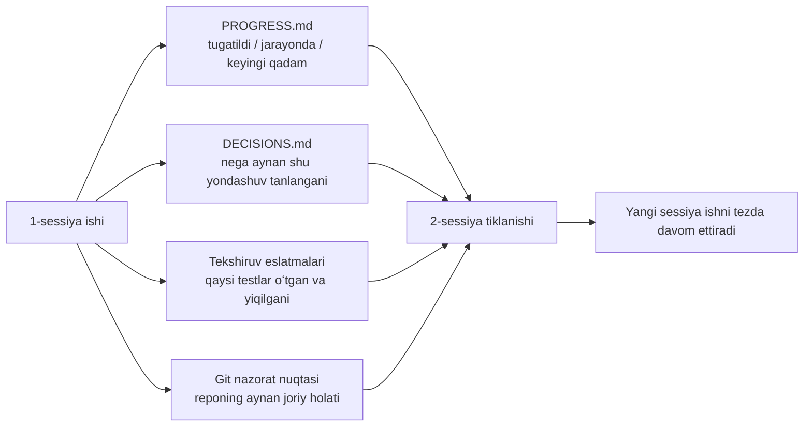

[English version →](../../../en/lectures/lecture-05-why-long-running-tasks-lose-continuity/)

> Kod misollari: [code/](https://github.com/walkinglabs/learn-harness-engineering/blob/main/docs/en/lectures/lecture-05-why-long-running-tasks-lose-continuity/code/)
> Amaliy loyiha: [Loyiha 03. Koʻp sessiyali uzluksizlik](./../../projects/project-03-multi-session-continuity/index.md)

# 5-maʼruza. Sessiyalar oʻrtasida kontekstni saqlab qoling

Siz Claude Codeʼdan toʻliq bitta funksiyani (feature) yaratishni soʻraysiz. U 30 daqiqa ishlaydi, ishning koʻp qismini bajaradi, lekin kontekst tugab bormoqda. Siz davom ettirish uchun yangi sessiya boshlaysiz — va u oʻtgan safar qanday qarorlar qabul qilinganini, nima uchun B varianti A variantdan afzal koʻrilganini, qaysi fayllar allaqachon oʻzgartirilganini yoki testlar qanday holatda ekanini eslay olmasligini bilib olasiz. U loyihani qayta oʻrganish uchun 15 daqiqa sarflaydi va oldingi yondashuvga zid ishlarni qilishi mumkin.

Tasavvur qiling, siz har tong uygʻonganda hamma narsani unutib qoʻyadigan usta boʻlsangiz. Siz butun qurilish maydoni bilan qaytadan tanishib chiqishingiz kerak boʻladi — qaysi devor yarim qurilgan, nima uchun koʻk gʻishtlar oʻrniga qizil gʻishtlar tanlangan, vodoprovod quvurlari qayergacha yetib kelgan. Eng yomoni, kecha oʻrnatib boʻlingan derazani — uning oʻrnatilganligini eslay olmaganingiz uchungina — buzib tashlashingiz mumkin.

Bu AI kod yozish agentlari sessiyalararo vazifalarda duch keladigan aynan shu qiyin vaziyatdir. Ushbu maʼruza nima uchun uzoq davom etadigan vazifalarda agentlar xotirasini yoʻqotishini (“black out”) va qanday qilib holatni tizimli saqlash (state persistence) orqali ularni ishonchli kundalik yuritadigan ustaga aylantirish mumkinligini tushuntiradi — u hamon amneziyaga chalingan, ammo kundalik hamma narsani eslab qoladi.

## Kontekst oynalari cheksiz emas

Kontekst oynalari (context windows) cheklangan. Buni modelni yangilash orqali hal qilib boʻlmaydi — garchi oyna oʻlchami 1M tokengacha oshsa ham, murakkab vazifalar baribir ularni yeb tugatadi. Chunki agentlar shunchaki kod yozmaydi; ular kod bazasini tushunadi, oʻzlarining qaror qabul qilish tarixini kuzatib boradi, vositalarning natijalarini qayta ishlaydi va suhbat kontekstini saqlab turadi. Barcha bu maʼlumotlar oyna oʻsishidan koʻra tezroq koʻpayadi.

Chuqurroq muammo shundaki: agent ishlab chiqaradigan maʼlumotlar bir xil darajada muhim emas. Oraliq mantiqiy xulosalar qadamlari qarorlarning “nega” ekanligini oʻz ichiga oladi — nima uchun A oʻrniga B varianti tanlangan, nima uchun u emas bu kutubxona, nima uchun maʼlum bir optimallashtirish oʻtkazib yuborilgan. Yakuniy natija faqat “nima” ekanligini — yaʼni kodning oʻzini oʻz ichiga oladi. Zichlash (compaction) strategiyalari odatda oxirgisini saqlab qoladi, lekin birinchisini yoʻqotadi. Keyingi sessiya kodni koʻradi, lekin nega aynan shunday yozilganini bilmaydi va qasddan qabul qilingan dizayn qarorini “optimallashtirib” yuborishi mumkin.

Anthropic oʻzining uzoq vaqt oladigan (long-running) agent tadqiqotlarida ajoyib narsani aniqladi: agentlar kontekst tugab borayotganini sezganda, ularda “erta yakunlash” (premature convergence) xulq-atvori paydo boʻladi — joriy ishni tugatishga shoshish, tekshiruv qadamlarini oʻtkazib yuborish yoki optimal yechim oʻrniga oddiyini tanlash. Bu xuddi imtihonda vaqt tugab borayotganini tushunib, qolgan test savollariga tavakkaliga javob belgilab chiqishga oʻxshaydi. Anthropic buni “kontekst xavotiri (context anxiety)” deb ataydi.

## Sessiya uzluksizligi oqimi

Uzluksizlik artefaktlarisiz har bir yangi sessiya falokatdir:



Uzluksizlik artefaktlari yordamida yangi sessiyalar ishni tezda davom ettirishi mumkin:



## Asosiy tushunchalar

- **Kontekst oynalari cheklangan**: Qanday oyna oʻlchami daʼvo qilinmasin (128K, 200K, 1M), uzoq davom etadigan vazifalar oxir-oqibat ularni yeb tugatadi. Tugagandan soʻng, zichlash (maʼlumot yoʻqotish) yoki qayta ishga tushirish (yangi sessiya) talab qilinadi. Ikkalasida ham nimanidir yoʻqotasiz.
- **Uzluksizlik artefaktlari (Continuity artifacts)**: Yangi sessiyaga oxirgi sessiya toʻxtagan joydan hech qanday noaniqliksiz davom ettirish imkonini beruvchi doimiy saqlangan holat fayllari. Asosiy shakli: jarayon jurnali + tekshiruv qaydnomasi + keyingi qadamlar. Oʻsha ustaning kundaligi kabi.
- **Tiklash narxi (Rebuild cost)**: Yangi sessiyaning bajariladigan holatga kelishi uchun kerak boʻladigan vaqt. Yaxshi harnessʼlar tiklash narxini 15 daqiqadan 3 daqiqagacha qisqartirishi mumkin.
- **Siljish (Drift)**: Agentʼning tushunchasi va kod repozitoriysining haqiqiy holati oʻrtasidagi farq. Har bir sessiya chegarasi siljishni keltirib chiqaradi; nazoratsiz u tobora ortib boradi.
- **Kontekst xavotiri (Context anxiety)**: Anthropic tomonidan kuzatilgan hodisa — agentlar idrok qilinayotgan kontekst chegaralariga yaqinlashganda erta yakunlash xatti-harakatlarini namoyish etadilar, maʼlumot yoʻqotilishining oldini olish uchun vazifalarni erta yakunlaydilar. Bu asossiz resurs xavotiridir.
- **Zichlash va qayta ishga tushirish (Compaction vs reset)**: Zichlash joriy sessiya ichidagi kontekstni xulosalaydi (“nima” saqlanadi, lekin “nega” yoʻqolishi mumkin); qayta ishga tushirish esa doimiy saqlangan holatdan tiklanadigan yangi sessiyani ochadi (toza, lekin artefaktlarning toʻliqligiga bogʻliq).

## Uzluksizlik buzilganda nima sodir boʻladi

Oldingi sessiya uchta yondashuvni tahlil qilib B variantni tanlashga salmoqli kontekst byudjetini sarfladi. Bu sessiyadagi agent oʻsha tahlil haqida bilmaydi va chala maʼlumot asosida qaytadan qaror qabul qilishi — ehtimol A variantni tanlashi mumkin. Xuddi amneziyaga chalingan usta qizil gʻisht nima uchun tanlanganini eslay olmasdan, bugun koʻk gʻishtga qarab uni chiroyliroq deb oʻylaydi. Soʻngra kecha qurilgan devorni buzib, uni qaytadan quradi.

Undan ham yomoni takroriy ishlardir. Agent qaysidir ishlarning oldin bajarilgan yoki yoʻqligiga ishonch hosil qila olmaydi va uni qaytadan bajaradi. Yoki eng yomoni — yarmini bajaradi, mavjud kod bilan ziddiyatga duch keladi va ishni boshidan qilishi kerak boʻladi. Qurilish maydonchasida ikkita jamoa bir vaqtda bitta devorni qura olmaydi — lekin jarayon (progress) qaydlari boʻlmasa, yangi jamoa u yerda kimdir ishlayotganini bilmaydi.

Bir nechta sessiyalar davomida implementatsiya yoʻnalishi asl talablardan sekin-asta uzoqlashib ketgan boʻlishi mumkin (drift). Har bir yangi sessiya loyiha maqsadlarini biroz boshqacha tushunadi. Xuddi “buzuq telefon” oʻyini kabi — oʻnta odam orqali xabar uzatilgach, “menga qahva olib kel” degan soʻz “menga qahva mashinasi sotib ol” ga aylanib ketishi mumkin.

Shuningdek, tekshiruv tafovuti (verification gap) ham mavjud. Oldingi sessiyaning tekshiruv natijalari (qaysi testlar oʻtgan, qaysilari yiqilgan, nega yiqilgani) yozib olinmagan. Yangi sessiya joriy holatni tushunish uchun barcha tekshiruvlarni qaytadan oʻtkazishi kerak. Har bir sessiya hamma narsani noldan tashxis qiladi va har safar qimmatli kontekstni behuda sarflaydi.

OpenAI va Anthropic ikkalasi ham oʻz hujjatlarida holatni tizimli saqlash (structured state persistence) ni taʼkidlaydi. OpenAIʼning harness muhandisligi haqidagi maqolasi repozitoriyni “operatsion qaydnoma” (operational record) sifatida koʻradi — har bir amalning natijalari repoda kuzatilishi mumkin boʻlgan iz qoldirishi kerak. Anthropicʼning koʻp vaqt oladigan agentlar hujjatlari maxsus “topshirish fayllari”ni (handoff files) tavsiya qiladi — ular joriy holat, maʼlum muammolar va keyingi qadamlarni oʻz ichiga olgan tizimli hujjatlardir.

## Amneziyali usta uchun kundalik

Asosiy yondashuv: **Agentʼga xotirasini yoʻqotadigan iqtidorli muhandis sifatida munosabatda boʻling.** Ishini yakunlashidan (“clock out”) oldin u muhim maʼlumotlarni yozib qoldirishi kerak, shunda keyingi “smenadagi” agent ishni tezda davom ettira oladi.

**1-vosita: Jarayon fayli (PROGRESS.md).** Eng asosiy uzluksizlik artefakti — kundalikning oʻzagi:

```markdown
# Loyiha jarayoni

## Joriy holat
- Oxirgi commit: abc1234 (feat: user preferences endpoint qoʻshildi)
- Test holati: 42/43 oʻtdi (test_pagination_edge_case yiqildi)
- Lint: oʻtdi

## Tugatildi
- [x] Foydalanuvchi modeli va maʼlumotlar bazasi migratsiyasi
- [x] Asosiy CRUD endpointʼlar
- [x] Auth middleware integratsiyasi

## Jarayonda
- [ ] Pagination funksiyasi (90% - edge case test yiqilmoqda)

## Maʼlum muammolar
- test_pagination_edge_case boʻsh natija qaytarganda 500 xatosini bermoqda
- Oʻchirilgan foydalanuvchilar roʻyxatda chiqishi yoki yoʻqligini aniqlash kerak

## Keyingi qadamlar
1. Pagination edge case bugʻini toʻgʻrilash
2. "include deleted users" soʻrov parametrini qoʻshish
3. API hujjatlarini yangilash
```

**2-vosita: Qarorlar jurnali (DECISIONS.md).** Muhim dizayn qarorlari va ularning sabablarini yozib boring. Batafsil dizayn hujjatlariga hojat yoʻq — shunchaki “qanday qaror, nega, qachon” — kundalikdagi eslatmalar (memos) kabi:

```markdown
# Dizayn qarorlari

## 2024-01-15: User preferences keshini saqlash uchun Redisʼdan foydalanish
- Sabab: Yuqori oʻqish chastotasi (har bir API chaqiruvi uchun), kichik maʼlumot hajmi
- Rad etilgan alternativa: PostgreSQL materialized view (tez-tez oʻzgarish xizmat koʻrsatish narxini oqlamaydi)
- Cheklov: Keshning yashash vaqti (TTL) 5 daqiqa, yozish vaqtida faol bekor qilish (invalidation)
```

**3-vosita: Checkpoint sifatida Git commitʼlar.** Har bir butun ishni tugatgandan soʻng commit qiling. Commit xabarlari nima qilingani va nega qilinganini tushuntirishi kerak. Bular bepul, avtomatik versiyalanadigan holat snapshotʼlari.

**4-vosita: init.sh yoki harness inisializatsiya jarayoni.** `AGENTS.md` faylida “ishni boshlash” va “ishni tugatish” tartiblarini aniq koʻrsating:

```markdown
## Sessiya boshlanganda (clock in)
1. Joriy holatni bilish uchun PROGRESS.mdʼni oʻqish
2. Muhim qarorlar uchun DECISIONS.mdʼni oʻqish
3. Repo muvofiq (consistent) holatda ekanligini tasdiqlash uchun make check ishga tushirish
4. Ishni PROGRESS.mdʼdagi "Keyingi qadamlar" boʻlimidan davom ettirish

## Sessiya tugashidan oldin (clock out)
1. PROGRESS.mdʼni yangilash
2. Repo muvofiq holatda ekanligini tasdiqlash uchun make check ishga tushirish
3. Barcha tugatilgan ishlarni commit qilish
```

**Aralash strategiya (Mixed strategy)**: Hamma vazifa ham kontekstni qayta oʻrnatishni (reset) talab qilavermaydi. Qisqa vazifalar (30 daqiqadan kam) bitta sessiya ichida yakunlanishi mumkin. Uzoq davom etadigan vazifalar uzluksizlik uchun jarayon fayllari (progress files) va qaror jurnallaridan foydalanishi shart. Qaror mezoni: agar vazifa oynaning 60% dan koʻprogʻini talab qilsa, topshirishga (handoff) tayyorgarlik koʻrishni boshlang.

### Kontekst xavotirini (Context Anxiety) chuqurroq oʻrganish

Anthropicʼning 2026-yil mart oyidagi tadqiqotlari kontekst xavotirining oʻziga xos koʻrinishlarini ochib berdi: Sonnet 4.5 da kontekst oyna chegarasiga yaqinlashganda, agent kuchli “erta yakunlash” xatti-harakatini namoyish etadi. Bu xuddi imtihonda vaqt tugab qolganini tushunib, test variantlarini koʻr-koʻrona belgilashga oʻxshaydi.

Buni hal qilishning ikkita strategiyasi bor:

**Zichlash (Compaction)**: Bitta sessiya ichida oldingi suhbatni qisqacha xulosalash. Afzalligi: uzluksizlikni saqlaydi, agent “nima”ligini koʻra oladi. Kamchiligi: xulosalarda koʻpincha “nega” yoʻqoladi — nima uchun A oʻrniga B tanlangani, nima uchun aynan bitta optimallashtirish tashlab ketilgani. Eng yomoni shundaki, zichlash kontekst xavotirini yoʻqotmaydi — agent qachonlardir kontekst katta boʻlganini biladi va ruhiy jihatdan baribir vazifani tezroq yopishga harakat qiladi.

**Kontekstni qayta ishga tushirish (Context reset)**: Kontekstni butunlay tozalash, yangi sessiya ochish, doimiy saqlangan artefaktlardan tiklash. Afzalligi: toza mental holat — yangi sessiyada “vaqtim tugab qolyapti” degan xavotir yoʻq. Kamchiligi: topshirish artefaktlarining (handoff artifacts) toʻliqligiga bogʻliq. Agar kundalikda muhim maʼlumot yetishmasa, yangi sessiya notoʻgʻri yoʻnalishda ketib, vaqtni behuda sarflashi mumkin.

Anthropicʼning real maʼlumotlari: Sonnet 4.5 uchun kontekst xavotiri shu qadar jiddiyki, faqat zichlash yetarli emas — kontekstni qayta ishga tushirish (context reset) harness dizaynining muhim qismiga aylanadi. Ammo Opus 4.5 uchun bu xatti-harakat ancha kamaygan, va zichlash resetʼlarga tayanmasdan kontekstni boshqara oladi. Bu shuni anglatadiki: **harness dizayni maqsadli modelni chuqur tushunishga tayanishi kerak, hammabop (one-size-fits-all) andozaga emas.**

> Manba: [Anthropic: Uzoq vaqt ishlovchi dasturlar uchun harness dizayni (Harness design for long-running application development)](https://www.anthropic.com/engineering/harness-design-long-running-apps)

## Hayotiy misol

Agentʼga foydalanuvchi autentifikatsiyasiga ega blog tizimini yaratish topshirildi — 12 ta funksionallik (feature point), bajarish uchun 5 ta sessiya hisoblangan.

**Kundaliksiz boshlangʻich holat**: 1-sessiya foydalanuvchi modeli va asosiy routeʼlarni amalga oshirdi. 2-sessiya auth middlewareʼning interfeys shartnomasi (contract) esdan chiqqan holatda boshlandi va oldingi dizayn maqsadini taxmin qilish uchun ~15 daqiqa sarfladi. 3-sessiyaga kelib, toʻplangan siljish (drift) agentʼni allaqachon tugatilgan funksiyalarni qaytadan yaratishga olib keldi. 5-sessiyaga kelib, repoda juda koʻp ortiqcha kodlar bor edi, lekin asosiy auth funksiyasi haligacha E2E testlaridan (end-to-end tests) oʻtmagan edi. 12 ta funksionallikdan faqat 7 tasi tugallandi, shundan 3 tasida yashirin toʻgʻrilik muammolari mavjud edi. Xuddi kundalik tutmaydigan ustaga oʻxshaydi — beshinchi kunga kelib, qurilish maydonchasida betartiblik, baʼzi devorlar ikki marta qurilgan, qurilishi kerak boʻlganlari esa umuman boshlanmagan.

**Kundalik bilan holat**: Jarayon fayllari, qarorlar jurnallari, tekshiruv (verification) qaydlari va git checkpointʼlaridan foydalanilgan. Holat haqidagi hisobot har bir sessiya oxirida avtomatik ravishda yangilanadi. 2-sessiyani tiklash narxi (rebuild cost) ~3 daqiqaga tushdi. 5-sessiyaga kelib, barcha 12 ta funksionallik tugallandi va tekshirildi.

Miqdoriy taqqoslash: tiklash vaqti ~78% ga qisqardi, funksiyalarning tugallanish darajasi 58% dan 100% ga koʻtarildi, yashirin nuqsonlar darajasi 43% dan 8% gacha pasaydi. Usta hamon amneziyaga chalingan, ammo kundaligi tufayli har bir kun noldan emas, balki kecha toʻxtagan joyidan boshlanadi.

## Asosiy xulosalar

- Kontekst oynalari cheklangan resursdir. Uzoq vazifalar sessiyalarga boʻlinadi, va sessiyalarda maʼlumot yoʻqoladi — har kuni hamma narsani unutadigan usta kabi, bu obyektiv haqiqatdir.
- Yechim kattaroq oynalar emas — bu holatni saqlashni yaxshilash. Jarayon fayllari + qaror jurnallari + git checkpointʼlari — amneziyali ustaga ishonchli kundalik bering.
- Agentʼga xotirasini yoʻqotgan muhandis kabi munosabatda boʻling: u “ishni tugatishidan” (clock out) oldin, nima qilingani, nega qilingani va keyingi nima ekanini yozib qoldirsin.
- Tiklash narxi (rebuild cost) asosiy koʻrsatkichdir. Yaxshi harnessʼlar yangi sessiyani 3 daqiqa ichida ishga tushiradigan holatga keltirishi kerak.
- Aralash strategiya (Mixed strategy): qisqa vazifalar bitta sessiyada, uzoq davom etadigan vazifalar uzluksizlik uchun tizimli artefaktlar bilan sessiyalararo.

## Qoʻshimcha oʻqish uchun

- [Anthropic: Effective Harnesses for Long-Running Agents](https://www.anthropic.com/engineering/effective-harnesses-for-long-running-agents)
- [OpenAI: Harness Engineering](https://openai.com/index/harness-engineering/)
- [Lost in the Middle: How Language Models Use Long Contexts](https://arxiv.org/abs/2307.03172)
- [Claude Code Documentation](https://docs.anthropic.com/en/docs/claude-code)
- [HumanLayer: Harness Engineering for Coding Agents](https://humanlayer.dev/articles/harness-engineering-for-coding-agents/)

## Mashqlar

1. **Uzluksizlik yoʻqolishini oʻlchash**: Kamida 3 ta sessiyani talab qiladigan ishlab chiqish vazifasini tanlang. Hech qanday uzluksizlik artefaktlarini bermasdan, har bir sessiya boshida agent “oʻtgan safar nima boʻlganini” tushunish uchun qancha kontekst sarflashini yozib boring. Har bir sessiyadan soʻng jarayon faylini (progress file) yarating va keyingi sessiya ishni shu yerdan boshlashiga imkon bering. Jarayon fayllari boʻlgan va boʻlmagan holatdagi tiklash narxlarini solishtiring.

2. **Topshirish (handoff) andozasi dizayni**: Toʻrtta maydonga (field) ega minimal topshirish andozasini (handoff template) tuzing: repo holati (commit hash), runtime holati (testlardan oʻtish koʻrsatkichi), toʻsiqlar (blockers), keyingi qadamlar. Faqat shu andozadan foydalangan holda mutlaqo yangi agent sessiyasi loyiha holatini tiklashiga imkon bering. Tiklash paytida duch kelingan noaniqliklarni qayd eting, andozani yaxshilash uchun buni takrorlang.

3. **Aralash strategiya tajribasi**: 5 sessiyali rivojlanish vazifasida uchta strategiyani solishtiring: (a) har safar yangi sessiyalar + jarayon fayllaridan boshlash, (b) imkon qadar bitta sessiyada koʻproq ish qilish (kontekstni zichlash), (c) aralash strategiya (sessiya ichida qisqa vazifalar, sessiyalar orasida uzun vazifalar + jarayon fayllari). Tiklash vaqtini, xususiyatlarning bajarilish darajasini va qarorlar izchilligini solishtiring.
