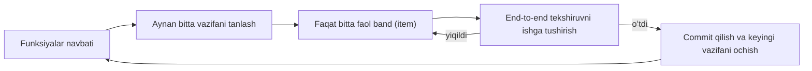
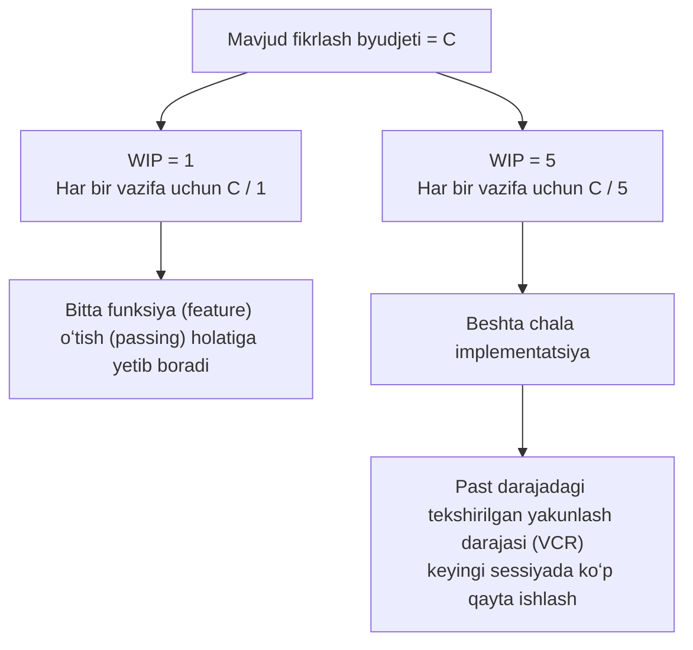

[English version →](../../../en/lectures/lecture-07-why-agents-overreach-and-under-finish/)

> Kod misollari: [code/](https://github.com/walkinglabs/learn-harness-engineering/blob/main/docs/en/lectures/lecture-07-why-agents-overreach-and-under-finish/code/)
> Amaliy loyiha: [Loyiha 04. Runtime qayta aloqa va skoup nazorati](./../../projects/project-04-incremental-indexing/index.md)

# 7-maʼruza. Agentlar uchun aniq vazifa chegaralarini chizing

Siz Claude Codeʼga “bu loyihaga foydalanuvchi autentifikatsiyasini qoʻsh” deysiz, u esa maʼlumotlar bazasi sxemasini oʻzgartirishdan, marshrutlarni (routes) yozishdan, frontend komponentlarini oʻzgartirishdan boshlaydi va — shu yoʻl-yoʻlakay — xatoliklarni qayta ishlash middlewareʼini (error-handling middleware) refaktoring qilib ketadi. Ikki soatdan keyin tekshirasiz: 12 ta fayl oʻzgartirilgan, 800 qator yangi kod yozilgan, lekin bittayam funksionallik (feature) boshidan oxirigacha (end-to-end) ishlamayapti.

Qornidan kattaroq tishlash — bu ibora AI agentlariga juda mos tushadi. Agentlar “bir oz qoʻshimcha ish qilish” impulsi bilan tugʻiladi — ular bir-biriga bogʻliq narsalarni koʻrishadi va ularni shunchaki yoʻl-yoʻlakay hal qilib ketishadi, xuddi supermarketga bir shisha soya sousi uchun kirib, toʻla aravacha bilan chiqib kelgan odam kabi. Muammo shundaki, haddan tashqari koʻp narsa sotib olgan odam shunchaki pulini isrof qiladi; agentlarning bir vaqtning oʻzida juda koʻp ishlarni qilishi esa u ishlarning birortasi ham toʻgʻri oxiriga yetmaydi deganidir.

Anthropicʼning “Uzoq vaqt ishlovchi agentlar uchun samarali harnessʼlar (Effective harnesses for long-running agents)” muhandislik blogida aniq yozilgan: promptʼlar (koʻrsatmalar) juda keng boʻlganda, agentlar “avval bitta ishni tugatish” oʻrniga “bir vaqtning oʻzida bir nechta ishni boshlash”ga moyil boʻlishadi. OpenAIʼning Codex muhandislik amaliyotlari ham xuddi shuni aniqladi — aniq skoup nazorati (scope control) boʻlmagan vazifalarning tugallanish koʻrsatkichlari keskin tushib ketadi. Bu modelning muammosi emas — bu harness muammosi. Siz chegarani chizib bermagansiz.

## Diqqat — cheklangan resurs

Bu qandaydir metafora emas — bu matematika. Aytaylik, agentʼning kontekst sigʻimi C ga teng va u bir vaqtning oʻzida k ta vazifani faollashtiradi. Har bir vazifaga oʻrtacha C/k mantiqiy fikrlash resursi toʻgʻri keladi. Qachonki C/k bitta vazifani yakunlash uchun kerak boʻladigan eng kam chegaradan (minimum threshold) tushib ketsa, ularning birortasi ham tugatilmaydi. Sizning oshqozoningizning ham sigʻimi maʼlum — bir vaqtning oʻzida oʻnta manti tiqsangiz, ularning hammasini hazm qila olmaysiz, shunchaki oʻn marta hazmsizlikka duch kelasiz, xolos.

Claude Codeʼning haqiqiy xatti-harakati buni aniq koʻrsatadi. Unga “foydalanuvchi roʻyxatdan oʻtishini qoʻshish”ni soʻrang va u quyidagilarni qilishi mumkin:

1. User modelini yaratish
2. Roʻyxatdan oʻtish marshrutini yozish
3. Elektron pochtani tasdiqlash kerakligini payqab, pochta xizmatini qoʻshish
4. Parollarni heshlash (hashing) kerakligini koʻrib, bcrypt ni olib kirish
5. Xatoliklarni qayta ishlash tizimi bir xil emasligini sezib, global xatolik middlewareʼini refaktoring qilish
6. Test fayllarining strukturasi tartibsiz ekanligini koʻrib, katalogni qayta tashkil qilish

Oltita qadam oʻtgach, ularning har biri chala bajarilgan boʻladi. Hech qanday end-to-end tekshiruv (verification) yoʻq, chala pishgan kodlar oʻrtasida murakkab bogʻlanishlar mavjud boʻladi va chala ishlarni davom ettirishi kerak boʻlgan keyingi sessiya mutlaqo adashib qoladi. Xuddi bir vaqtning oʻzida oltita taom pishirayotgan odamga oʻxshaydi — hamma ovqat tovadadir, lekin birortasi ham tortilmagan (plated). Ularning hammasi kuyadi.

Anthropicʼning eksperimental maʼlumotlari buni bevosita tasdiqlaydi: “kichik keyingi qadam” (small next step) strategiyasidan (WIP=1 ga teng) foydalanadigan agentlar keng promptʼlardan foydalanadigan agentlarga qaraganda 37% yuqori vazifa yakunlash darajasini koʻrsatadi. Eng qizigʻi shundaki, agentlar tomonidan yozilgan kod qatorlarining soni haqiqatda yakunlangan funksiyalar bilan zaif manfiy (teskari) korrelyatsiyaga ega — kod qanchalik koʻp yozilsa, shuncha kam funksiyalar yakunlanadi. Oʻzi chaynay oladiganidan kattaroq tishlash, maʼlumotlar bilan isbotlangan.

## WIP=1 Ish jarayoni (Workflow)





## Asosiy tushunchalar

- **Haddan oshish (Overreach)**: Agent bitta sessiyada optimal miqdordan koʻra koʻproq vazifalarni faollashtirishi. Buni oʻlchash mumkin — bittayam end-to-endʼdan oʻtmagan holatda 5 ta funksiyani bajarish bu haddan oshishdir.
- **Oxiriga yetkazmaslik (Under-finish)**: Barcha faollashtirilgan vazifalar ichidan, end-to-end tekshiruvidan muvaffaqiyatli oʻtgan vazifalarning ulushi belgilangan meʼyordan (threshold) tushib ketishi. Kod yozilgan, ammo testlar oʻtmagan holat bu — oxiriga yetkazmaslikdir.
- **WIP chegarasi (WIP Limit / Work-in-Progress Limit)**: Kanban metodologiyasidan olingan. Asosiy gʻoya: bir vaqtning oʻzida qancha vazifa jarayonda ekanligini cheklash. Agentlar uchun WIP=1 eng xavfsiz standart (default) hisoblanadi — keyingisini boshlashdan oldin bittasini tugatish. Shved stoli (buffet) kabi — likopchangizga hamma narsani uyavermang, bitta likopchani tugating, soʻngra keyingisi uchun qaytib boring.
- **Bajarilganlik dalili (Completion Evidence)**: Vazifaning “jarayonda” (in progress) bosqichidan “tugatildi” (done) bosqichiga oʻtishi uchun qanoatlantirishi kerak boʻlgan tekshirilishi mumkin boʻlgan shart. Busiz agentlar “testlardan muvaffaqiyatli oʻtdi” oʻrniga “kod yaxshi koʻrinyapti”ni qabul qilishadi.
- **Skoup yuzasi (Scope Surface)**: Har bir tugun ishlash birligi va chekkalar (edges) qaramliklar (dependencies) boʻlgan DAG (Directed Acyclic Graph) strukturasi. Holatlar toʻrtta bilan cheklangan: not_started (boshlanmagan), active (faol), blocked (toʻsilgan), passing (oʻtgan).
- **Tugatish bosimi (Completion Pressure)**: Harnessʼning WIP chegaralari va bajarilganlik dalillari talablari orqali agentga oʻtkazadigan cheklovchi kuchi boʻlib, u agentni yangisini boshlashdan oldin joriy vazifani yakunlashiga majbur qiladi.

## Haddan oshish va oxiriga yetkazmaslik oʻzaro bogʻliqdir (Symbiotic)

Bu ikkala muammo mustaqil emas — ular bir-birini kuchaytiradi. Haddan oshish diqqatni susaytiradi, susaygan diqqat oxiriga yetkazmaslikka olib keladi va qoldirilgan chala yozilgan kod tizim murakkabligini oshiradi, bu esa keyingi vazifada yanada koʻproq haddan oshishni keltirib chiqaradi. Yopiq doira (vicious cycle).

Kanban atamalarida: Little qonuni bizga L = lambda * W ekanligini aytadi. Agar jarayondagi ish L (bir vaqtda qilinayotgan ishlar) juda koʻp boʻlsa, har bir vazifa uchun ketadigan vaqt W muqarrar ravishda oshadi. Agentlar uchun bu shuni anglatadiki, har bir funksiyaning boshlanishidan tortib to tasdiqlangan holatda yakunlanishiga qadar boʻlgan vaqt uzayadi va muvaffaqiyatsizlik ehtimoli ortib boradi.

Bu insonlar olamida ham qadimiy muammo — Steve McConnell oʻzining *Rapid Development* kitobida skoupning kengayib ketishi (scope creep) loyiha muvaffaqiyatsizligining asosiy sababi ekanligini hujjatlashtirgan. Lekin odamlarda hech boʻlmaganda “men yetarlicha ishladim” degan ichki sezgi bor. Agentlarda esa bu umuman yoʻq. Keyingi gʻoyani oʻylab topish model uchun deyarli hech qanday qoʻshimcha tokenlarga tushmaydi — “shu yerga kelgan ekanman, buni ham toʻgʻrilab ketay” deb yozish deyarli sezilmaydi — lekin har bir qoʻshimcha oʻzgartirish agentning diqqatini chalgʻitadi. Bu xuddi shved stoliga oʻxshaydi — har bir qoʻshimcha likopchaning xarajati nolga yaqin. Ammo sizning oshqozoningiz sigʻimi cheklangan.

## Buni qanday toʻgʻri qilish kerak

### 1. WIP=1 ni qatʼiy talab qiling

Bu eng bevosita va samarali usul. Harnessʼingizda agentga ochiq-oydin shunday deng: **har qanday vaqtda faqat bitta vazifa “faol” (active) holatda boʻlishiga ruxsat beriladi.** Claude Codeʼning CLAUDE.md yoki Codexʼning AGENTS.md faylida shunday yozing:

```
## Ish qoidalari
- Bir vaqtning oʻzida bitta funksiya (feature) ustida ishlang
- Keyingi funksiyani faqat joriysi end-to-end tekshiruvdan oʻtgandan keyingina boshlang
- A funksiyasini amalga oshirish vaqtida B funksiyasini "qoʻshimchasiga refaktoring qilmang"
```

Xuddi shved stolida ovqatlanishdek — bir vaqtning oʻzida bitta likopcha oling, koʻproq olish uchun qaytib borishdan oldin uni tugating.

### 2. Har bir vazifa uchun aniq bajarilganlik dalilini belgilang

Tugatildi (done) degani bu “kod yozildi” emas — bu “xatti-harakat tekshiruvdan oʻtdi” degani. Funksiyalar roʻyxatingizda (feature list) har bir yozuvda (entry) tekshiruv buyrugʻi (verification command) boʻlishi kerak:

```
F01: Foydalanuvchi roʻyxatdan oʻtishi
  Tekshiruv: curl -X POST /api/register -d '{"email":"test@example.com","password":"123456"}' | jq .status == 201
  Holat: passing
```

### 3. Skoup yuzasini tashqariga chiqaring (Externalize)

Barcha vazifa holatlarini yozib borish uchun mashina oʻqiy oladigan fayldan (JSON yoki Markdown) foydalaning. Har qanday yangi sessiya ushbu faylni oʻqiy oladi va darhol bilib oladi: qaysi vazifa faol? Qanday xatti-harakat bajarilgan (done) deb hisoblanadi? Qaysi tekshiruvlar (verifications) oʻtdi?

### 4. Tekshirilgan yakunlash darajasini (VCR) kuzatib boring

Harness VCR (Verified Completion Rate) ni doimiy kuzatib borishi kerak = tekshirilgan vazifalar / faollashtirilgan vazifalar. Agar VCR < 1.0 boʻlsa, yangi vazifa faollashtirilishini bloklang.

## Hayotiy misol

8 ta funksiyaga ega REST API loyihasi, taqqoslangan ikkita strategiya:

**Shved stoli rejimi (cheklovsiz)**: Agent 1-sessiyada 5 ta funksiyani bir vaqtda faollashtiradi. 12 ta faylda ~800 qator kod yozadi. End-to-end testlaridan oʻtish darajasi: 20% — faqat foydalanuvchi roʻyxatdan oʻtish qismi ishlaydi. Qolgan 4 ta funksiya: maʼlumotlar bazasi sxemasi yaratilgan lekin validatsiya (validation) mantigʻi yoʻq, marshrutlar (routes) belgilangan lekin xato formatda javob qaytarmoqda. Bu xuddi oltita taomni bir vaqtda pishirayotgan odamga oʻxshaydi — ulardan faqat bittasigina zoʻrgʻa yeyishga yaroqli boʻlgan. 3-sessiya oxiriga kelib, 8 ta funksiyadan faqat 3 tasi tugatilgan.

**Bitta likopcha rejimi (WIP=1)**: Agent 1-sessiyada faqat foydalanuvchi roʻyxatdan oʻtishi ustida ishlaydi. 4 ta faylda ~200 qator kod yozadi. End-to-end testlar: 100% oʻtmoqda. Toza, tekshirilgan implementatsiyani commit qiladi. 4-sessiya oxiriga kelib, 8 ta funksiyadan 7 tasi yakunlanadi (8-chisi tashqi qaramlik (external dependency) sababli toʻxtatib qoʻyilgan).

Natija: umumiy yozilgan kod kamroq (WIP=1 da 800 qator, shved stoli rejimida 1200 qator), lekin samaraliroq. Yakunlash darajasi: 87.5% va 37.5%. Bir vaqtning oʻzida bitta tishlamdan olsangiz, haqiqatda koʻproq yeysiz.

## Asosiy xulosalar

- **WIP=1 bu agent harnessʼlari uchun standart xavfsiz sozlamadir** — bittasini tugating, keyin boshqasini boshlang; parallel bajarishga urinmang. Bir tishlashda semirib qolmaysiz.
- **Bajarilganlik dalili bajarilishi (executable) mumkin boʻlishi shart** — “kod yaxshi koʻrinyapti” degani hisobga oʻtmaydi; “curl 201 qaytardi” degani oʻtadi.
- **Skoup yuzasi (scope surface) tashqi fayl sifatida yozilishi shart** — nafaqat suhbatda aytib oʻtilishi, balki repoda mashina oʻqiy oladigan formatda yozib borilishi kerak.
- **Haddan oshish va oxiriga yetkazmaslik oʻzaro bogʻliqdir** — birini hal qilish ikkinchisini ham hal qiladi.
- **“Kamroq qil, lekin tugat” har doim “koʻproq qil, lekin chala tashlab ket”dan ustunroqdir** — agent tomonidan yozilgan kod qatorlari va funksiyalarning tugallanish darajasi bir-biriga teskari korrelyatsiyaga ega (negatively correlated). Sifat har doim miqdordan ustun turadi.

## Qoʻshimcha oʻqish uchun

- [Effective harnesses for long-running agents - Anthropic](https://www.anthropic.com/engineering/effective-harnesses-for-long-running-agents) — Anthropicʼning muhandislik blogi, “kichik keyingi qadam” strategiyasini chuqur muhokama qiladi.
- [Harness Engineering - OpenAI](https://openai.com/index/harness-engineering/) — OpenAIʼning harness muhandisligi haqidagi toʻliq qoʻllanmasi.
- [Kanban: Successful Evolutionary Change - David Anderson](https://www.goodreads.com/book/show/1070822.Kanban) — WIP cheklovlari boʻyicha klassik manba.
- [Rapid Development - Steve McConnell](https://www.goodreads.com/book/show/125171.Rapid_Development) — Skoup kengayib ketishi (scope creep) loyiha muvaffaqiyatsizligining asosiy sababi ekanligini koʻrsatuvchi empirik maʼlumotlar.

## Mashqlar

1. **Vazifani atomizatsiya qilish (Task Atomization)**: Katta bir talabni tanlang (masalan, “foydalanuvchilarni boshqarish tizimini amalga oshirish”) va uni kamida 5 ta atomik ishlash birligiga boʻling. Har bir birlik uchun quyidagilarni aniqlang: (a) yagona xatti-harakat tavsifi, (b) bajariladigan (executable) tekshiruv buyrugʻi, (c) qaramliklar (dependencies). Boʻlinish WIP=1 cheklovini qanoatlantirishi yoki yoʻqligini tekshiring.

2. **Taqqoslash tajribasi**: Bir xil loyihani ikki marta ishga tushirib koʻring — birinchi marta hech qanday cheklovsiz, ikkinchi marta WIP=1 ga qatʼiy amal qilgan holda. Taqqoslang: tekshirilgan yakunlash darajasi (VCR), umumiy yozilgan kod qatorlari soni, samarali kod nisbati.

3. **Bajarilganlik dalili auditi**: Yaqinda qilingan agent sessiyasi natijalarini koʻrib chiqing, har bir kod oʻzgarishini “tugallangan xatti-harakat”, “tugallanmagan xatti-harakat” yoki “qolip (scaffolding)” sifatida tasniflang. Har bir tugallanmagan xatti-harakat uchun yetishmayotgan tekshiruv buyruqlarini qoʻshing.
