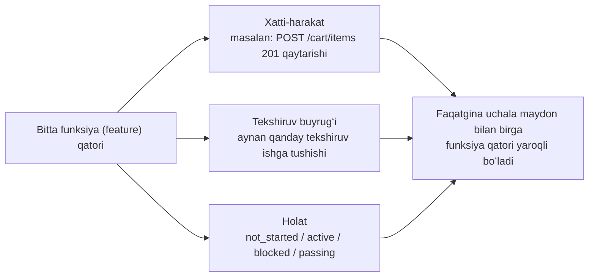

[English version →](../../../en/lectures/lecture-08-why-feature-lists-are-harness-primitives/)

> Kod misollari: [code/](https://github.com/walkinglabs/learn-harness-engineering/blob/main/docs/en/lectures/lecture-08-why-feature-lists-are-harness-primitives/code/)
> Amaliy loyiha: [Loyiha 04. Runtime qayta aloqa va skoup nazorati](./../../projects/project-04-incremental-indexing/index.md)

# 8-maʼruza. Agent nima qilishini cheklash uchun funksiyalar roʻyxatidan foydalaning

Siz agentdan e-tijorat saytini qurishni soʻraysiz. Ishini tugatgandan soʻng, u sizga “tugatdim” deydi. Kodni koʻrib chiqasiz — foydalanuvchi autentifikatsiyasi ishlayapti, lekin savatdagi (shopping cart) “sotib olish” (checkout) tugmasi hech narsa qilmaydi va toʻlov jarayoni (payment flow) umuman ulanmagan. Muammo shundaki: siz unga hech qachon “tugatish” (done) nimani anglatishini aytmagansiz, shuning uchun u oʻzining shaxsiy standartini — “Men juda koʻp kod yozdim va u ancha tugallanganga oʻxshaydi” degan standartni ishlatdi.

Koʻpchilikning nazarida funksiyalar roʻyxati (feature lists) shunchaki eslatma (memo) — esdan chiqarmaslik uchun yoziladi, soʻngra bir chetga yigʻishtirib qoʻyiladi. Lekin harness olamida funksiyalar roʻyxati odamlar uchun eslatma emas — u butun harnessʼning umurtqa pogʻonasidir (backbone). Rejalashtiruvchi (scheduler) qaysi vazifani tanlashda unga suyanadi, tekshiruvchi (verifier) yakunlanganligini baholashda unga suyanadi, topshirish hisobotchisi (handoff reporter) xulosalar yaratishda unga suyanadi. Umurtqani sindirsangiz butun tana falaj boʻladi.

Anthropic ham, OpenAI ham alohida taʼkidlaydi: **artefaktlar tashqariga chiqarilishi (externalized) shart.** Funksiya (feature) holati (state) tuzilmagan suhbat matni ichida emas, balki repodagi mashina oʻqiy oladigan faylda yashashi kerak.

## Agentlar “Tugatildi” nimani anglatishini bilmaydi

Na Claude Code va na Codex sizning “tugatildi” deganda nimani nazarda tutayotganingizni avtomatik ravishda bilmaydi. Siz “savat (shopping cart) funksiyasini qoʻsh” deysiz va modelning talqini “Cart komponentini va addToCart metodini yozish” boʻlishi mumkin. Siz esa “foydalanuvchi mahsulotlarni koʻra oladi, savatga qoʻsha oladi va toʻlov jarayonini (checkout) boshidan oxirigacha (end-to-end) tugata oladi” deb nazarda tutgansiz. Funksiyalar roʻyxati boʻlmasa, bu tushunmovchilik saqlanib qolaveradi. Agent oʻzining yashirin (implicit) standartidan foydalanadi — odatda “kodda aniq sintaksis xatolari yoʻq” degan maʼnoda. Sizga kerak boʻlgan narsa bu end-to-end xatti-harakat tekshiruvidir (behavioral verification). Xuddi doʻstingizdan meva sotib olishni soʻraganingiz kabi — “ozgina meva olib kel” deysiz va u limon koʻtarib keladi. Uning mevasi bilan sizning mevangiz bir xil meva emas.

Ushbu keng tarqalgan jarayon eslatmasini (progress note) koʻrib chiqing:

```
User auth qilindi, savat asosan tugatildi, toʻlov qismi (payments) hali kerak
```
Yangi agent sessiyasi ushbu eslatmadan quyidagi savollarga javob bera oladimi? “Asosan tugatildi” deganda nima nazarda tutilgan? Savat qaysi testlardan oʻtdi? Toʻlovlar (payments) qilinishiga nima toʻsqinlik qilyapti (blocking)? Bularning barchasiga javob — “hech kim bilmaydi”. Xuddi shifokorga “oshqozonim ogʻriyapti, lekin oxirgi paytda yaxshi edim” deyishga oʻxshaydi — u sizga qanday dori yozib bera oladi?

Natija: yangi sessiya loyiha holatini (project state) tushunish uchun 20 daqiqa sarflaydi va allaqachon bajarilgan funksiyalarni qaytadan yozib chiqishi mumkin. Anthropicʼning muhandislik maʼlumotlari shuni koʻrsatadiki, jarayon boʻyicha yaxshi qaydlar sessiyani ishga tushishdan keyingi tashxis vaqtini 60-80% ga qisqartiradi.

## Funksiya holati mashinasi (Feature State Machine)



```mermaid
flowchart LR
    List["feature_list.json / features.md"] --> Scheduler["Keyingi not_started bandini (item) tanlash"]
    Scheduler --> Agent["Agent aynan shu band (item) ustida ishlaydi"]
    Agent --> Verifier["Oʻsha bandning (item) tekshiruv buyrugʻini ishga tushirish"]
    Verifier -->|oʻtdi| Passing["Uni passing (oʻtdi) deb belgilash<br/>va dalilini (evidence) yozish"]
    Verifier -->|yiqildi| Active["Uni active (faol) qilib qoldirish"]
    Verifier -->|qaramlik (dependency) muammosi| Blocked["Uni blocked (toʻsilgan) deb belgilash"]
    Passing --> Handoff["Topshirish eslatmasi<br/>va joriy jarayonni yangilash"]
    Active --> Agent
```

## Asosiy tushunchalar

- **Funksiyalar roʻyxati harness primitivlaridir (primitives)**: Ular shunchaki “ixtiyoriy rejalashtirish vositalari” emas, balki barcha boshqa harness komponentlari tayanadigan bazaviy maʼlumotlar strukturasidir. Maʼlumotlar bazasi jadvali (database table) strukturalariga oʻxshab — siz “asosiy kalitlarni (primary keys) tashlab ketaylik” deya olmaysiz.
- **Uchlik struktura (Triple structure)**: Har bir funksiya (feature) bandi bu `(xatti-harakat tavsifi, tekshiruv buyrugʻi, joriy holat)` uchligidir. Har qanday elementning yoʻqligi ushbu bandni tugallanmagan (incomplete) qilib qoʻyadi.
- **Holat mashinasi modeli (State machine model)**: Har bir funksiya bandida toʻrtta holat mavjud — `not_started`, `active`, `blocked`, `passing`. Holat oʻzgarishlari harness tomonidan boshqariladi, agent tomonidan erkin oʻzgartirilmaydi.
- **Oʻtganlik holati boʻyicha tekshiruv (Pass-state gating)**: Funksiya (feature) `active` dan `passing` ga oʻtishining yagona yoʻli bu — tekshiruv buyrugʻi (verification command) muvaffaqiyatli ishlashidir. Buni orqaga qaytarib boʻlmaydi — bir marta `passing` boʻlgach, orqaga qaytmaydi. Xuddi imtihondan oʻtganingiz kabi, siz uni oʻtdingiz, bahoni orqaga qaytarib oʻzgartira olmaysiz.
- **Yagona haqiqat manbai (Single source of truth)**: “Nima qilinishi kerakligi” haqidagi barcha maʼlumotlar yagona funksiyalar roʻyxatidan (feature list) olinishi shart. Funksiyalar roʻyxati va suhbat tarixi oʻrtasida hech qanday qarama-qarshiliklar boʻlmasligi kerak.
- **Orqa bosim (Back-pressure)**: Hali oʻtmagan (not passed) funksiyalarning soni, harness agentga oʻtkazadigan bosimdir. Nol bosim = loyiha tugallandi degani.

## Nega funksiyalar roʻyxatlari “Primitivlar” (Primitives) boʻlishi kerak

Hujjatlar odamlar oʻqishi uchun; primitivlar tizimlar bajarishi uchundir. Hujjatlarga eʼtiborsizlik qilish mumkin; primitivlarni esa aylanib oʻtib boʻlmaydi.

Buni maʼlumotlar bazasi trigger cheklovlari va dastur darajasidagi (application-layer) tekshiruvlarga oʻxshating: birinchisi maʼlumotlar bazasi dvigateli tomonidan amalga oshiriladi, hech qanday SQL uni aylanib oʻtolmaydi; ikkinchisi esa ilova (application) kodining toʻgʻriligiga tayanadi va tasodifan chetlab oʻtilishi mumkin. Funksiyalar roʻyxati harness primitivi sifatida maxsus 4 ta harness komponentiga xizmat qiladi:

1. **Rejalashtiruvchi (Scheduler)**: Holatlarni oʻqiydi, keyingi `not_started` funksiyani (feature) tanlaydi. Zavoddagi ishlab chiqarishni rejalashtirish tizimiga oʻxshaydi.
2. **Tekshiruvchi (Verifier)**: Tekshiruv buyruqlarini (verification commands) bajaradi, holatni oʻtkazishga ruxsat berish-bermaslikni hal qiladi. Sifat nazoratiga oʻxshaydi.
3. **Topshirish hisobotchisi (Handoff reporter)**: Funksiyalar roʻyxatidan sessiya topshirish (handoff) xulosalarini avtomatik tarzda yaratadi. Avtomatik smena oʻzgarishi hisobotiga oʻxshaydi.
4. **Jarayonni kuzatuvchi (Progress tracker)**: Holat taqsimotini hisoblaydi, loyiha salomatligi metrikalarini taqdim etadi. Dashboard kabi.

## Buni qanday toʻgʻri qilish kerak

### 1. Minimal funksiyalar roʻyxati formatini belgilang

Sizga murakkab tizim kerak emas — strukturalangan Markdown yoki JSON fayli kifoya qiladi. Asosiy shart shuki, har bir yozuvda (entry) quyidagi uchlik (triple) boʻlishi kerak:

```json
{
  "id": "F03",
  "behavior": "POST /cart/items ni {product_id, quantity} bilan joʻnatganda 201 qaytaradi",
  "verification": "curl -X POST http://localhost:3000/api/cart/items -H 'Content-Type: application/json' -d '{\"product_id\":1,\"quantity\":2}' | jq .status == 201",
  "state": "passing",
  "evidence": "commit abc123, test output logi"
}
```

### 2. Holat oʻzgarishini (State Transitions) boshqarishni Harnessʼga topshiring

Agent bitta funksiya holatini toʻgʻridan-toʻgʻri `passing` ga oʻzgartira olmaydi. U faqat tekshiruv soʻrovini (verification request) yuborishi mumkin; harness tekshiruv buyrugʻini ishga tushirib, unga ruxsat berish yoki bermaslikni oʻzi hal qiladi. Bu “oʻtish holatini nazorat qilish” (pass-state gating) deb ataladi.

### 3. Qoidalarni CLAUDE.md fayliga yozing

```
## Funksiyalar roʻyxati (Feature List) qoidalari
- Funksiyalar roʻyxati fayli: /docs/features.md
- Bir vaqtda faqat bitta funksiya (feature) faol (active) boʻladi
- Uni oʻtdi (passing) deb belgilashdan oldin tekshiruv buyrugʻi oʻtgan boʻlishi shart
- Funksiya (feature) roʻyxati holatlarini oʻzingiz oʻzgartirmang — ularni tekshiruv (verification) skripti avtomatik ravishda yangilaydi
```

### 4. Darajalashni (Granularity) toʻgʻrilash

Har bir funksiya (feature) bandi “bitta sessiyada tugatilishi mumkin” boʻlgan darajada belgilanishi kerak. Juda keng boʻlsa — tugamaydi; juda kichik boʻlsa — boshqarish qiyinlashadi. “Foydalanuvchi savatga mahsulot qoʻshishi mumkin” — bu toʻgʻri darajalash (granularity). “Savat (shopping cart)ni amalga oshirish (implement qilish)” — juda keng. “Cart modelida name maydonini (field) yaratish” — juda tor. Xuddi goʻshtni kesishga oʻxshaydi — butun boʻlak ham emas, qiyma ham emas.

## Hayotiy misol

10 ta funksiyaga ega boʻlgan e-tijorat (e-commerce) platformasi. Taqqoslangan ikkita kuzatish (tracking) yondashuvi:

**Eslatma rejimi (Memo mode)**: Agent hech qanday strukturaga ega boʻlmagan eslatmalardan (unstructured notes) foydalanadi. 3 sessiyadan keyin eslatmalar quyidagi koʻrinishga keladi: “foydalanuvchi auth va mahsulotlar roʻyxati bajarildi, savat asosan tugatildi lekin bugʼlari bor, toʻlovlar (payments) boshlanmadi”. Yangi sessiya holatni tushunib olishi uchun 20 daqiqa kerak boʻladi va oxir-oqibat allaqachon yakunlangan funksiyalarni qaytadan yozib chiqadi. Bu xuddi bozordagi xaridingiz roʻyxatida “sut, non va anavi narsa” deb yozilganiga oʻxshaydi — doʻkonga borgach, baribir nimani olishingiz kerakligini bilmaysiz.

**Umurtqa pogʻona rejimi (Backbone mode)**: Har bir funksiyaning (feature) aniq holati va tekshiruv buyrugʻi (verification command) bor. Yangi sessiya funksiyalar roʻyxatini oʻqiydi va 3 daqiqa ichida hamma narsani tushunib oladi: F01-F05 — `passing`, F06 — `active`, F07-F10 — `not_started`. Ishni toʻgʻridan-toʻgʻri F06 dan boshlaydi, hech qanday ishni boshidan qilmaydi (zero rework).

Miqdoriy natija (Quantified result): Strukturalangan funksiyalar roʻyxatidan (structured feature lists) foydalangan loyihalar erkin kuzatish (free-form tracking) tizimidagiga qaraganda 45% ga yuqori funksiyalarni tugallash (feature completion) darajasini koʻrsatdi va hech qanday funksiya takror amalga oshirilmadi.

## Asosiy xulosalar

- **Funksiyalar roʻyxatlari — bu odamlar uchun eslatma emas, ular harnessʼning umurtqa pogʻonasidir (backbone).** Rejalashtiruvchi, tekshiruvchi va topshirish hisobotchisi barchasi shunga tayanadi.
- **Har bir funksiya (feature) bandida uchlik (triple) boʻlishi shart**: xatti-harakat (behavior) tavsifi + tekshiruv buyrugʻi (verification command) + joriy holat (current state). Birgina elementning yetishmasligi uni tugallanmagan qilib qoʻyadi — xuddi bir oyogʻi yoʻq uch oyoqli stul kabi.
- **Holat (State) oʻzgarishlari harness tomonidan boshqariladi** — agent holatlarni oʻzboshimchalik bilan oʻzgartira olmaydi. Tekshiruvdan oʻtish = oldinga oʻtishning yagona yoʻli.
- **Funksiyalar roʻyxati bu loyihaning yagona haqiqat manbai (single source of truth)** — barcha “nima qilish kerak” maʼlumotlari yagona roʻyxatdan kelib chiqadi.
- **Darajalanishni (granularity) “bitta sessiyada tugatilishi mumkin” degan qoidaga asosan toʻgʻrilang.**

## Qoʻshimcha oʻqish uchun

- [Building Effective Agents - Anthropic](https://www.anthropic.com/research/building-effective-agents) — Funksiyalar roʻyxatini (feature list) agent skoupini (scope) boshqarish uchun “asosiy maʼlumotlar strukturasi” ekanligini aniq koʻrsatib beradi.
- [Harness Engineering - OpenAI](https://openai.com/index/harness-engineering/) — "artefaktlarni tashqariga chiqarish" (externalizing artifacts) tamoyilini alohida taʼkidlaydi.
- [Design by Contract - Bertrand Meyer](https://www.goodreads.com/book/show/130439.Object_Oriented_Software_Construction) — Shartnoma dizayni tamoyillari (Contract design principles), funksiyalar roʻyxatining nazariy asosi.
- [How Google Tests Software](https://www.goodreads.com/book/show/13563030-how-google-tests-software) — Test piramidasi (Test pyramid) va xulq-atvor (behavioral) spetsifikatsiyasi muhandislik amaliyotlari.

## Mashqlar

1. **Funksiyalar roʻyxati dizayni (Feature List Design)**: Minimal funksiyalar roʻyxati JSON sxemasini belgilang. Qatnashishi kerak: id, xatti-harakat (behavior) tavsifi, tekshiruv buyrugʻi (verification command), joriy holat, dalilga (evidence) ishora. Undan foydalanib 5 ta funksiyaga (feature) ega haqiqiy loyihani taʼriflang.

2. **Tekshiruvning qatʼiyligini taqqoslash**: 3 ta funksiyani tanlang va ular uchun ham “yumshoq” (loose) tekshiruv (masalan, “kodda sintaksis xatolari yoʻq”), ham “qatʼiy” (strict) tekshiruv (masalan, “end-to-end test oʻtmoqda”) ishlab chiqing. Har bir yondashuv boʻyicha soxta musbat (false positive) koʻrsatkichini solishtiring.

3. **Yagona manba tamoyili (Single Source Principle) auditi**: Mavjud boʻlgan agent loyihasini koʻrib chiqing va funksiyalar roʻyxatiga (feature list) zid boʻlgan skoup (scope) maʼlumotlarini qidiring (suhbatlardagi yashirin talablar, koddagi TODO izohlar va h.k.). Barcha maʼlumotlarni funksiyalar roʻyxatiga birlashtirish rejasini ishlab chiqing.
