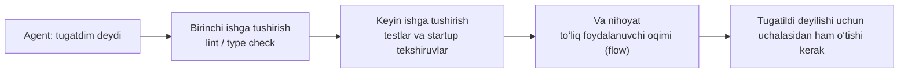
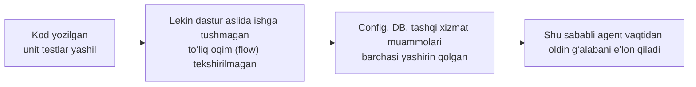

[English version →](../../../en/lectures/lecture-09-why-agents-declare-victory-too-early/)

> Ushbu maʼruza uchun kod misollari: [code/](https://github.com/walkinglabs/learn-harness-engineering/blob/main/docs/en/lectures/lecture-09-why-agents-declare-victory-too-early/code/)
> Amaliy loyiha: [Loyiha 05. Agentga oʻz ishini oʻzi tekshirishiga imkon bering](./../../projects/project-05-grounded-qa-verification/index.md)

# 9-maʼruza. Agentlarni vaqtidan oldin gʻalabani eʼlon qilishdan saqlash

Siz agentdan “parolni tiklash” funksiyasini qoʻshishni soʻraysiz. U maʼlumotlar bazasi sxemasini oʻzgartiradi, API endpointʼini yozadi, elektron pochta andozasini (email template) qoʻshadi, unit testlarni ishga tushiradi (hammasi oʻtadi) va soʻngra sizga ishonch bilan “tugatdim” deydi. Haqiqatda ishlatib koʻrsangiz—parolni tiklash havolasi yuborilmaydi (elektron pochta xizmati sozlamalari yoʻq), maʼlumotlar bazasi migratsiyasi yarmida yiqiladi (sxema noaniqligi), va end-to-end oqimi (flow) biror marta ham ishga tushirib koʻrilmagan.

Bu tuygʻu sizga begona boʻlmasa kerak — u imtihon qogʻozini toʻldirib chiqib, birinchi boʻlib oʻziga ishonch bilan topshiradigan, lekin baholar eʼlon qilinganda yiqiladigan talabaga oʻxshaydi. Qogʻozning toʻla boʻlishi javoblar toʻgʻri ekanligini anglatmaydi.

Bu tasodifiy voqea emas. 2017-yildagi ICML konferensiyasida Guo va boshqalarning mashhur maqolasi shuni isbotladi: **zamonaviy neyron tarmoqlari tizimli ravishda oʻziga oʻta ishonadi (overconfident)** — modellar tomonidan eʼlon qilingan ishonch ularning haqiqiy aniqligidan sezilarli darajada yuqori. Xuddi shu narsa AI kod yozish agentlariga ham tegishli: ular oʻzlarini “tugatdim” deb his qilishadi, lekin aslida ular tugatishdan yiroqdirlar. Sizning harnessʼingiz agentning “hissiyotlari”ni tashqi, ishlashga asoslangan (execution-based) tekshiruv (verification) bilan almashtirishi kerak.

## Sirpanchiq qiyalik (The Slippery Slope)

Vaqtidan oldin “tugadim” deyish deyarli har doim bir xil andozada (pattern) kechadi: kod yuzaki qaraganda mantiqli koʻrinadi — sintaksis toʻgʻri, mantiq joyidadek, va statik tahlil (static analysis) aniq xatolarni koʻrsatmaydi. Lekin harness qamrovli runtime tekshiruvni majbur qilmaydi, shu sababli agent uni haqiqatda ishga tushirib koʻrishni oʻtkazib yuboradi yoki faqat qisman testlarni ishga tushiradi. U unit testlarni ishga tushiradi, lekin integratsiya testlarini (integration tests) oʻtkazib yuboradi; u testlarni ishga tushiradi, lekin qamrovni (coverage) tekshirmaydi. Oxir-oqibat, “kod yaxshi koʻrinyapti” degan dalil “funksiya (feature) tugatildi” degan xulosaga asos qilib olinadi. Va imtihon qogʻozi topshiriladi.

Har bir bosqichda maʼlumot yoʻqoladi. Vazifa spetsifikatsiyasidan kod implementatsiyasiga, undan esa runtime xatti-harakatigacha, har bir oʻzgarish biroz ogʻish (bias) keltirib chiqarishi mumkin va har bir oʻtkazib yuborilgan tekshiruv bu maʼlumot assimetriyasini kuchaytiradi.

## Uch qatlamli tugatish tekshiruvi (Termination Check)





## Asosiy tushunchalar

- **Vaqtidan oldin “tugadim” deyish (Premature Completion Declaration)**: Agent vazifani bajarilgan deb eʼlon qiladi, lekin qanoatlantirilmagan toʻgʻrilik (correctness) shartlari hali ham mavjud. Asosiy muammo: agent faqat kod darajasidagi mahalliy ishonchga suyanadi, holbuki tizim darajasidagi toʻgʻrilik global tekshiruvni (verification) talab qiladi.
- **Ishonchni kalibrlash ogʻishi (Confidence Calibration Bias)**: Agentning vazifani yakunlagani haqidagi oʻziga boʻlgan ishonchi va uning amaldagi sifat darajasi oʻrtasidagi tizimli farq. Koʻp faylli murakkab vazifalarda bu ogʻish doim musbat — agent har doim haqiqiy natijasidan koʻra oʻziga koʻproq ishonadi. Xuddi imtihondan chiqib oʻz bahosini har doim oshirib taxmin qiladigan talaba kabi.
- **Tugatish mezonlari (Termination Criteria)**: Harnessʼda belgilangan aniq, bajariladigan (executable) baholash shartlari toʻplami. Agent ishni tugatdim deyishidan oldin barcha shartlarni qanoatlantirishi shart. “Tugatildi” degan soʻz subyektiv his-tuygʻudan obyektiv tushunchaga aylanadi.
- **Verifikatsiya-Validatsiya qoʻsh darvozasi (Verification-Validation Dual Gate)**: Birinchi verifikatsiya qatlami “kod koʻrsatilgan xatti-harakatni toʻgʻri amalga oshirdimi” deganini tekshiradi; ikkinchi validatsiya qatlami “tizim darajasidagi xatti-harakat end-to-end talablarga javob beradimi” deganini tekshiradi. Tugatilgan deb hisoblanishi uchun ikkalasi ham oʻtishi shart.
- **Runtime qayta aloqa signallari (Runtime Feedback Signals)**: Dastur ishlashi davomidagi loglar, jarayon holatlari va health checkʼlar. Bu harnessʼning sifatni obyektiv baholashi uchun asosdir.
- **Tugatishning ustuvorlik cheklovi (Completion Priority Constraint)**: Avval funksional toʻgʻrilikni (correctness) tekshiring, keyin samaradorlik (performance) ni hal qiling, va nihoyat uslubni (style) toʻgʻrilang. Asosiy funksiya tekshiruvdan oʻtmaguncha refaktoring qilish taqiqlanadi.

## Unit testlardan oʻtish ≠ Vazifa yakunlandi

Bu eng keng tarqalgan va eng xavfli tuzoqdir. Agent kodni yozdi, unit testlarni ishga tushirdi, hammasi yashil boʻldi va “tugatdim” dedi. Lekin unit testlarning dizayn falsafasi — tekshirilayotgan qismni izolyatsiya qilish va qaramliklarni (dependencies) mock qilish (soxtalashtirish) — aynan komponentlararo muammolarni topishga qodir emasligini keltirib chiqaradi:

**Interfeys mos kelmasligi (Interface Mismatch)**: Render jarayonidan preload skriptiga uzatilgan fayl yoʻli nisbiy yoʻl (relative path), ammo preload skripti mutlaq yoʻl (absolute path) kutmoqda. Ularning mos unit testlari mockʼlardan foydalangan va oʻtgan. Muammo faqat end-to-end testlar paytida maʼlum boʻladi. Bu xuddi musiqiy guruhdagi har bir sozanda oʻzi uchun mukammal mashq qilishiga oʻxshaydi. Ammo hammalari birgalikda chalganida, musiqalar bir-biriga mos tushmayotganini anglab yetadilar.

**Holatning notoʻgʻri tarqalishi (State Propagation Errors)**: Maʼlumotlar bazasi migratsiyasi jadval sxemasini oʻzgartiradi, biroq ORM kesh qatlami eski sxema boʻyicha maʼlumotlarni keshda saqlashda davom etmoqda. Unit testlar har doim mutlaqo yangi mock muhitini taqdim etadi, bu esa ushbu qatlamlararo holat nomuvofiqligini (cross-layer state inconsistency) koʻrsatib berolmaydi.

**Muhitga bogʻliqlik (Environment Dependency)**: Kod test muhitida toʻgʻri ishlaydi (chunki u yerda hamma narsa mock qilingan), lekin konfiguratsiyadagi farqlar, tarmoq kechikishlari (network latency) yoki xizmatning ishlamay qolishi sababli haqiqiy muhitda yiqiladi. Xuddi repititsiya zalida zoʻr kuylab, sahnada esa audio uskunalaridagi muammolarga duch kelishga oʻxshaydi.

### “Shu bahonada refaktoring ham qilib ketay” — tugatishni baholash uchun zahardir

Claude Codeʼda shunday keng tarqalgan xulq-atvor bor: asosiy funksiya (core feature) tekshiruvdan oʻtmasidan avval u kodni refaktoring qilishni, samaradorlikni oshirishni (performance optimization) va uslubni yaxshilashni boshlaydi. Knuthʼning mashhur “Vaqtidan oldin optimallashtirish (premature optimization) — barcha yomonliklarning ildizidir” maqoli agent ssenariysida oʻzgacha ahamiyat kasb etadi — refaktoring tekshirilgan va tekshirilmagan kod oʻrtasidagi chegarani oʻzgartiradi, ehtimol, ilgari toʻgʻri ishlagan kod yoʻllarini ham buzib yuborishi mumkin. Bu xuddi matematika imtihonida insho savollarini hali yechib tugatmasdan turib, test javoblaringizni chiroyliroq yozish uchun oqqa koʻchirishga oʻxshaydi — siz nafaqat vaqtni behuda sarflaysiz, balki ularni notoʻgʻri koʻchirib qoʻyishingiz ham mumkin.

### Oʻz-oʻzini baholashdagi tizimli ogʻish (Systematic Bias)

Anthropic 2026-yildagi tadqiqotlarida ancha jiddiyroq xato modelini aniqladi: **agentdan oʻz ishini oʻzi baholashini soʻrashganida, u har doim oʻta ijobiy baho beradi — garchi bu holatni inson kuzatuvchisi yaqqol past sifatda qilingan deb hisoblasa ham.** Bu oʻquvchidan oʻz imtihon qogʻozini oʻzi tekshirishini soʻrashga oʻxshaydi — ular oʻz javoblariga doim alohida yumshoqlik bilan yondashadilar.

Bu muammo ayniqsa subyektiv vazifalarda (masalan, dizayn estetikasi) jiddiy namoyon boʻladi — “ushbu layout qanchalik chiroyli”ligi baholanishi kerak boʻlganda, agent oʻz ishini ijobiy tomonga ogʻdirib baholaydi. Hatto tasdiqlash mumkin boʻlgan aniq natijali vazifalarda ham, agentning samaradorligi oʻziga nisbatan xolisona boʻlmagan baholash tufayli pasayadi.

Buning yechimi agentni “yanada obyektiv qilish” emas — kod yozayotgan model bilan tekshirayotgan model bitta boʻlsa, u doimo oʻziga yon bosishga moyil boʻladi. **Yechim “bajaruvchi” (worker) va “tekshiruvchi”ni (checker) bir-biridan ajratishdir.** Xuddi oʻquvchi oʻz imtihonini oʻzi tekshirmasligi kabi — sizga mustaqil tekshiruvchi kerak.

Mustaqil baholovchi (evaluator) agentni aynan “injiq” (picky) boʻlishga sozlash, kod yaratuvchi agentga oʻzini-oʻzi baholatishdan koʻra ancha samaralidir. Anthropicʼdan tajriba maʼlumotlari:

| Arxitektura | Runtime | Narx | Asosiy funksiyalar ishlayaptimi? |
|--------------|---------|------|------------------------|
| Bitta Agent (bare run) | 20 daq | $9 | Yoʻq (oʻyin obyektlari javob qaytarmaydi) |
| Uchta Agent (rejalashtiruvchi + yaratuvchi + tekshiruvchi) | 6 soat | $200 | Ha (oʻyin toʻliq ishlaydi) |

Bu ayni bitta model (Opus 4.5) va bitta prompt (“2D retro oʻyin muharririni yarat”). Faqatgina harness farq qiladi — “qoʻshimcha tuzilmasiz muhit (bare environment)” dan “rejalashtiruvchi talablarni kengaytiradi → yaratuvchi birin-ketin funksiyalarni bajaradi → tekshiruvchi Playwright yordamida haqiqiy klik orqali testlarni (click testing) amalga oshiradi” formatiga oʻtilgan.

> Manba: [Anthropic: Uzoq vaqt ishlovchi dasturlar uchun harness dizayni (Harness design for long-running application development)](https://www.anthropic.com/engineering/harness-design-long-running-apps)

## Vaqtidan oldin “tugadim” deyishni qanday toʻxtatish mumkin

### 1. Tugatish bahosini tashqariga chiqaring (Externalize)

Ishning tugatilganini agent oʻzi hal qilmasligi kerak. Harness agentning oʻziga boʻlgan ishonchidan emas, balki runtime signallaridan foydalanib tugatishni alohida oʻzi validatsiya (validation) qilishi shart. Buni `CLAUDE.md` fayliga aniq qilib yozib qoʻying:

```
## Definition of Done (Bajarilganlik mezonlari)
- Funksiya yakunlandi (Feature complete) = "kod yozildi" degani emas, balki end-to-end tekshiruvdan oʻtdi deganidir
- Talab qilinadigan tekshiruv darajalari:
  1. Unit testlar oʻtadi
  2. Integratsiya testlari oʻtadi
  3. End-to-end oqimi (flow) tekshiruvdan oʻtadi
- Agar 1-daraja yiqilsa, 2-darajaga oʻtish mumkin emas
- Agar 2-daraja yiqilsa, 3-darajaga oʻtish mumkin emas
```

### 2. Uch qatlamli tugatish validatsiyasini (Termination Validation) yarating

- **1-qatlam: Sintaksis va Statik Tahlil**. Eng arzon narxli, eng kam maʼlumot beruvchi, ammo oʻtishi shart. Bu eng bazaviy tekshiruv — boshqa narsalarga qarashimizdan oldin kod xatosiz yozilganiga ishonch hosil qilishingiz kerak.
- **2-qatlam: Runtime Xatti-harakatlarni Tekshirish**. Testlarni ishga tushirish, ilova startup checkʼlari, eng muhim (critical) marshrutlar validatsiyasi. Bu tugallanganlikning asosiy dalilidir. Shunchaki yozib qoldirishning oʻzi yetarli emas; u ishlashi kerak.
- **3-qatlam: Tizim darajasida tasdiqlash**. End-to-end testlari, integratsiya validatsiyasi, foydalanuvchi ssenariysini imitatsiya qilish. Vaqtidan oldin tugadim deyishlarga qarshi soʻnggi mudofaa chizigʻi. Shunchaki ishlashning oʻzi yetarli emas; u toʻgʻri ishlashi kerak.

### 3. Agentlar uchun yaxshi “Qizil ruchkadagi belgilar” (Red Pen Markups) tayyorlang

OpenAI oʻzlarining Codex amaliyotlarida juda samarali usulni oʻylab topdi: **agentlar uchun xato xabarlari (error messages) toʻgʻrilash boʻyicha yoʻriqnomalarni oʻz ichiga olishi kerak**. Erinchoq tekshiruvchi kabi shunchaki katta qizil xoch chizib qoʻymang; yaxshi oʻqituvchi boʻlib, uning yoniga “buni mana bunday oʻzgartirishingiz kerak” deb yozib qoldiring. `"Test failed"` deb emas, balki `"Test failed: POST /api/reset-password 500 qaytardi. Muhit oʻzgaruvchilarida (environment variables) elektron pochta xizmati sozlamalari (config) mavjudligini tekshiring. Andoza (template) fayli templates/reset-email.html papkasida boʻlishi kerak."` Ushbu aniq, amalda bajarilishi mumkin boʻlgan (actionable) qayta aloqa agentga oʻz xatolarini inson aralashuvisiz tuzatish imkonini beradi.

### 4. Runtime signallarni yigʻib oling

Samarali runtime signallarga quyidagilar kiradi:
- Dastur muvaffaqiyatli ishga tushib (startup), tayyor holatga kela oldimi?
- Muhim funksiya (feature) yoʻllari runtime vaqtida muvaffaqiyatli ishladimi?
- Maʼlumotlar bazasiga yozishlar, fayl operatsiyalari va boshqa side effectʼlar toʻgʻrimi?
- Vaqtinchalik resurslar tozalandimi?

## Hayotiy misol

**Vazifa**: Foydalanuvchi parolini tiklash (password reset) funksiyasini qoʻshish. Bunga maʼlumotlar bazasi amallari, elektron pochta yuborish va API endpointʼlarini oʻzgartirish kiradi.

**Vaqtidan oldin topshirish yoʻli**: Agent maʼlumotlar bazasi sxemasini oʻzgartiradi, API endpointʼini yozadi, elektron pochta andozasini qoʻshadi, unit testlarni ishga tushiradi (hammasi oʻtadi) va ishni tugatganini eʼlon qiladi. Imtihon qogʻozi toʻliq toʻldirilgan.

**Aslida qayerdan ball olib tashlangan (Point deductions)**: (1) End-to-end oqimi sinovdan oʻtmagan — haqiqiy havolani yuborish va parolni tiklash ishlashi tasdiqlanmagan. (2) Maʼlumotlar bazasi migratsiyasi yarmi ishlagandan soʻng yiqilib, sxema nomuvofiqligini keltirib chiqargan. (3) Target muhitda elektron pochta xizmati sozlamalari (config) kiritilmagan.

**Harness aralashuvi**: Tugatish validatsiyasi (Termination validation) ishga tushdi — (1) Tiklash (reset) endpointʼiga kirish mumkinligini tekshirish uchun toʻliq ilovani ishga tushirish; (2) Toʻliq tiklash oqimini (reset flow) bajarish; (3) Maʼlumotlar bazasi holati toʻgʻriligini (consistency) tekshirish. Barcha xatoliklar shu sessiyaning oʻzida aniqlandi, bu esa keyingi yuzaga keladigan tuzatish narxini 5-10 barobargacha tejadi. Haqiqiy muammolarni mustaqil baholovchi (evaluator) topdi.

## Asosiy xulosalar

- **Agentlar tizimli ravishda oʻziga haddan ortiq ishonadi** — ishonchni kalibrlash ogʻishi (confidence calibration bias) bu obyektiv haqiqatdir. Imtihon qogʻozini toʻldirish bu hammasini toʻgʻri yechish degani emas.
- **Tugatish bahosi tashqariga chiqarilishi kerak** — uni harness mustaqil ravishda tekshiradi; agentning “hissiyotlari”ga ishonmang. Oʻquvchilar oʻzlarining imtihon qogʻozlarini oʻzlari baholay olmaydi.
- **Uchala validatsiya qatlami ham zarur** — sintaksisdan oʻtish, xatti-harakat (behavior) oʻtishi, tizim darajasidan oʻtish, hammasi qatlam-baqatlam amalga oshishi kerak.
- **Xato xabarlari (error messages) yaxshi oʻqituvchining qizil ruchkasi belgilariga oʻxshashi kerak** — agent oʻz xatosini oʻzi tuzatishi uchun xabar ichida uni qanday tuzatish qadamlari boʻlishi kerak.
- **Asosiy funksiya (core feature) tasdiqlanmaguncha refaktoring qilish taqiqlanadi** — tugatishning ustuvorlik cheklovi (completion priority constraint) vaqtidan oldin optimallashtirishning (premature optimization) oldini olishning kalitidir.

## Qoʻshimcha oʻqish uchun

- [On Calibration of Modern Neural Networks - Guo et al.](https://arxiv.org/abs/1706.04599) — Zamonaviy chuqur tarmoqlarning tizimli ravishda oʻta oʻziga ishonganini isbotlovchi maqola
- [Building Effective Agents - Anthropic](https://www.anthropic.com/research/building-effective-agents) — Tugatish bahosi uchun runtime dalillarining muhimligi
- [Harness Engineering - OpenAI](https://openai.com/index/harness-engineering/) — Vaqtidan oldin “tugadim” deyish agentlarning asosiy muvaffaqiyatsizlik turlaridan biridir
- [The Art of Software Testing - Myers](https://www.goodreads.com/book/show/137543.The_Art_of_Software_Testing) — Testlash metodlarining iyerarxiyasi va samaradorligi haqida klassik manba

## Mashqlar

1. **Tugatish validatsiyasi funksiyasining (Termination Validation Function) dizayni**: Maʼlumotlar bazasi migratsiyasi va API oʻzgartirishni oʻz ichiga olgan vazifa uchun toʻliq tugatish validatsiyasini loyihalang. Talab qilinadigan runtime signallarni va har bir signal uchun oʻtish/yiqilish shartlarini yozib chiqing. Uni haqiqiy vazifada ishlating va qanday yashirin muammolarni topganini yozib boring.

2. **Kalibrlash ogʻishini oʻlchash**: 10 xil kod yozish vazifasini tanlang, va agentning oʻz ishini tugatganligi haqidagi ishonch darajasini ishning haqiqiy sifati bilan solishtirib yozib boring. Ogʻish (bias) qiymatini hisoblang va uning vazifa murakkabligi bilan bogʻliqligini tahlil qiling.

3. **Koʻp qatlamli mudofaa tajribasi**: Bitta vazifalar roʻyxatida uchta konfiguratsiyani ishga tushiring — (a) faqat statik tahlil (static analysis), (b) unit testlarni qoʻshish, (c) toʻliq uch qatlamli validatsiya. Vaqtidan oldin “tugatdim” deyilish ulushini va tutilmagan (uncaught) defektlar sonini solishtiring.
