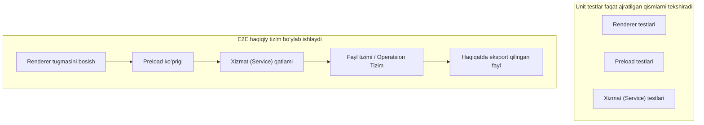
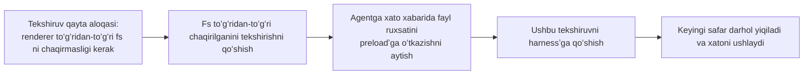

[English version →](../../../en/lectures/lecture-10-why-end-to-end-testing-changes-results/)

> Ushbu maʼruza uchun kod misollari: [code/](https://github.com/walkinglabs/learn-harness-engineering/blob/main/docs/en/lectures/lecture-10-why-end-to-end-testing-changes-results/code/)
> Amaliy loyiha: [Loyiha 05. Agentga oʻz ishini oʻzi tekshirishiga imkon bering](./../../projects/project-05-grounded-qa-verification/index.md)

# 10-maʼruza. Faqatgina End-to-End testlash chinakam tekshiruvdir

Siz agentdan Electron ilovasiga faylni eksport qilish funksiyasini qoʻshishni soʻraysiz. U render process komponentini, preload skriptini va xizmat qatlami mantigʻini yozadi. Har bir komponent uchun unit testlar ajoyib tarzda oʻtadi. Agent “Tugatildi” deydi. Export tugmasini bosganingizda esa — fayl yoʻli formati notoʻgʻri, progress bar ishlamayapti va katta fayllarni eksport qilish xotira sizib chiqishiga (memory leak) sabab boʻlyapti. Beshta komponent chegarasi muammolari, va unit testlar ularning bittasini ham tutib qola olmagan.

Bu xuddi xor (choir) repetitsiyasiga oʻxshaydi — har bir ovoz alohida aytganda mukammal eshitiladi, lekin hammalari birgalikda kuylashganda, sopranolar baslardan yarim takt tezlashib ketadi, joʻr ovoz esa asosiy ohangdan yarim tonda farq qiladi. Har bir qism oʻz-oʻzidan “toʻgʻri”, lekin umumiy ovoz ohangsiz.

Googleʼning Testlash piramidasi (Testing Pyramid) bizga shuni aytadi: juda koʻp sonli unit testlar poydevor hisoblanadi, biroq faqat ulargagina tayanilsa, siz muntazam ravishda komponentlarning oʻzaro ishlashi muammolarini koʻzdan qochirasiz. AI kod yozish agentlarida esa bu muammo yana ham jiddiyroq — agentlar asosan eng tez oʻtadigan testlarni ishga tushirishga va shundan keyin ishni tugatdim deyishga moyil. **Tizim darajasidagi nuqsonlar yoʻqligini faqat end-to-end testlar orqali isbotlash mumkin.**

## Unit testlashning koʻrinmas nuqtalari (Blind Spots)

Unit testlarning asosiy dizayn falsafasi bu izolyatsiyadir — qaramliklarni (dependencies) mock qilish (soxtalashtirish) va faqatgina bitta qismga qaratilishdir. Bu falsafa unit testlarni tez va aniq ishlaydigan qilsa-da, tizimli koʻrinmas nuqtalarni keltirib chiqaradi. Bu xor aʼzolarining faqat oʻz partiyalarini quloqchin taqib (naushnikda) repetitsiya qilishiga oʻxshaydi — ularga hamma narsa toʻgʻridek tuyuladi, ammo ular birlashgandagina asl muammolar namoyon boʻladi:

**Interfeys mos kelmasligi (Interface Mismatch)**: Render process orqali preload skriptiga uzatilgan fayl yoʻli (file path) bu nisbiy yoʻl (relative path), ammo preload skripti mutlaq yoʻl (absolute path) kutmoqda. Ularning mos unit testlari mockʼlardan foydalangan va muammosiz oʻtgan. Muammo faqat end-to-end oqimi (flow) ishga tushirilganda aniqlanadi — xuddi ikki ovoz partiyasi oʻz-oʻzicha toʻgʻri mashq qilayotgandek, sahnaga chiqqanida biri 4/4 taktda, ikkinchisi 3/4 taktda aytayotganini tushungani kabi.

**Holatning notoʻgʻri tarqalishi (State Propagation Errors)**: Maʼlumotlar bazasi migratsiyasi jadval sxemasini oʻzgartiradi, biroq ORM kesh qatlami eski sxema boʻyicha maʼlumotlarni keshda saqlashda davom etmoqda. Unit testlar har doim mutlaqo yangi mock muhitini taqdim etadi, bu esa ushbu qatlamlararo holat nomuvofiqligini (cross-layer state inconsistency) koʻrsatib berolmaydi. Bu xuddi qoʻshiq matni oʻzgartirilsa-da, kimningdir hali ham eski versiyada kuylashida davom etayotganiga oʻxshaydi.

**Resurs yashash davridagi muammolar (Resource Lifecycle Issues)**: Fayl descriptorʼlari, bazaga ulanishlar (database connections) va tarmoq socketʼlarini egallash va boʻshatish bir qancha komponentlarga taʼsir oʻtkazishi mumkin. Unit testlar har bir test uchun mustaqil resurslarni yaratib, soʻng ularni yakunlaydi; shuning uchun resurslar ustidagi ziddiyatlarni yoki ochiq qolib ketish holatlarini (leaks) koʻrsata olmaydi. Xuddi xorda hamma mikrofonni navbati bilan ishlatsa-da, lekin hammalari birga sahnaga chiqqanida hammaga mikrofon yetmay qolishiga oʻxshaydi.

**Muhitga bogʻliqlik (Environment Dependency)**: Kod test muhitida toʻgʻri ishlaydi (chunki u yerda hamma narsa mock qilingan), lekin konfiguratsiyadagi farqlar, tarmoq kechikishlari (network latency) yoki xizmatning ishlamay qolishi sababli haqiqiy muhitda yiqiladi. Xuddi repetitsiya zalida zoʻr kuylab, ochiq havodagi festivalda esa ovoz qaytishi (audio feedback) va shamol xalaqit bergandek.

## End-to-end testlash nafaqat natijalarni, balki xulq-atvorni ham oʻzgartiradi

Koʻpchilik tushunib yetmaydigan bir holat bor: qachonki agent oʻz ishining yakunida end-to-end test orqali tekshirilishini bilsa, uning kod yozish xatti-harakati oʻzgaradi.

1. **Komponentlarning oʻzaro ishlashini hisobga olish**: Kod yozayotganda u faqat bitta funksiyani koʻzlamay, “bu interfeys yuqori oqim (upstream) bilan qanday ulanadi” degan fikrni ham eʼtiborga oladi. Xuddi hammangiz baribir birgalikda kuylashingizni bilsangiz, mashgʻulot davomida boshqa ovoz partiyalariga ham eʼtibor berasiz.
2. **Arxitektura chegaralariga rioya qilish**: Arxitektura boʻyicha cheklovlari mavjud tizimlarda, end-to-end testlash agentni ushbu chegaralarni hurmat qilishiga majbur qiladi. Notadagi “kreshendo shu yerda boʻlsin” belgisi kabi, unga qatʼiy amal qilishingiz shart.
3. **Xatoliklar bilan ishlash (Error Paths)**: End-to-end testlar odatda xatolik ssenariylarini ham oʻz ichiga oladi, shuning sababdan agent istisnolar (exceptions) bilan qanday ishlashni inobatga olishiga toʻgʻri keladi. Xuddi repititsiya paytida “agar mikrofon oʻchib qolsa nima boʻladi” degan holatni sinab koʻrgandek, bu holatda nima qilish kerakligini bilasiz.

## Testlash piramidasi (Testing Pyramid) va tekshiruv qayta aloqasini kuchaytirish (Review Feedback Promotion)





Codex muhandislik amaliyotlarida OpenAI alohida taʼkidlaydi: **agentlar uchun yozilgan xato xabarlari (error messages) toʻgʻrilash yoʻriqnomalarini oʻz ichiga olishi shart.** Faqat `"Renderer ichida fayl tizimiga toʻgʻridan-toʻgʻri murojaat bor"` demang; uning oʻrniga `"Renderer ichida fayl tizimiga toʻgʻridan-toʻgʻri murojaat bor. Barcha fayl amallari preload koʻprigi orqali ishlashi shart. Buni preload/file-ops.ts ga oʻtkazing va window.api orqali chaqiring."` deb yozing. Bu arxitektura qoidalarini avtomatik tuzatish sikliga (auto-correction loop) aylantiradi. Xuddi xor dirijyori shunchaki “notoʻgʻri aytdingiz” deyish oʻrniga, “siz bu yerda yarim takt oldinga ketib qoldingiz, altning ritmini eshiting va 32-taktda birga kiring” degani kabi.

## Asosiy tushunchalar

- **Komponent chegarasi nuqsonlari (Component Boundary Defects)**: A va B komponentlari oʻz unit testlaridan oʻtadi, lekin ularning birgalikdagi ishi notoʻgʻri natija beradi. Bu end-to-end testlash eng yaxshi tutadigan turdagi muammodir — xuddi har bir partiyasi alohida toʻgʻri, ammo birgalikda ohangsiz xor partiyalari kabi.
- **Test yetarlilik gradienti (Testing Adequacy Gradient)**: Unit testlari ushlagan muammolar <= Integratsiya testlari ushlagan muammolar <= End-to-end testlari ushlagan muammolar. Har bir qatlam kashf etish imkoniyatini oshiradi.
- **Arxitektura chegaralarini majburiy qoʻllash qoidalari (Architectural Boundary Enforcement Rules)**: Arxitektura hujjatlaridagi qoidalarni (“render process fayl tizimiga bevosita murojaat qilolmaydi” kabi) avtomatik ishlaydigan va ijro etiladigan testlarga oʻtkazish. “Qogʻozda yozilgan”idan “CI tizimida ishga tushiriladigani”gacha.
- **Tekshiruv qayta aloqasini kuchaytirish (Review Feedback Promotion)**: Takroriy kod tekshiruv sharhlarini avtomatlashtirilgan testlarga aylantirish. Har gal takroriy muammo paydo boʻlganda qoida qoʻshasiz, shu tariqa harness borgan sari mustahkamlanadi. Goʻyoki xor rahbari har galgidek xatoliklarni tayyorgarlik mashqlariga aylantirib yuborsa — keyingi gal shu xato yana takrorlansa, dirijyor ogʻiz ochmasdanoq mashqning oʻzi muammoni topadi.
- **Agentga yoʻnaltirilgan xato xabarlari (Agent-Oriented Error Messages)**: Xato xabari shunchaki “nima xato” ekanini aytibgina qolmay, balki agentga qanday tuzatish kerakligini ham koʻrsatib berishi kerak. Bu har bir test yiqilishini oʻz-oʻzini toʻgʻrilaydigan jarayonga aylantiradi.

## Buni qanday qilish kerak

### 0. Avval Arxitektura chegaralarini belgilang, keyin E2E testlar yozing

End-to-end testlashning old sharti shundaki — avval tizim chegaralari aniq boʻlishi kerak. Agar arxitektura chigallashgan spagettiga oʻxshasa, end-to-end test faqatgina “bu spagetti ishlashini” tasdiqlaydi, qaysi joyida xato borligini aniq aytib bermaydi. Bu oʻz partiyalari boʻyicha hatto boʻlinmagan xorga oʻxshaydi — ming marta repetitsiya qilsangiz ham foydasi yoʻq.

OpenAI tajribasi: **agentlar orqali yaratilgan kodlarda, arxitektura cheklovlari bu kelajakda jamoa kengayganda qoʻshiladigan biror shart emas, bu loyihaning birinchi kunidanoq asos qilib qoʻyilishi kerak boʻlgan narsadir.** Bunga oddiy sabab bor — agentlar repozitoriydagi mavjud patternʼlardan, ular yomon yoki samarasiz boʻlsa ham, nusxa olishaveradi. Arxitektura chegaralari belgilab qoʻyilmaganida, agentlar har bir sessiyada koʻproq oʻzgaruvchan qoidalarni (deviations) olib kirishadi.

OpenAI “Qatlamli Domen Arxitekturasi”ni (Layered Domain Architecture) qoʻllagan — har bir biznes domen (business domain) aniq qatlamlarga ajratiladi: Types → Config → Repo → Service → Runtime → UI. Qaramliklar faqat yuqoridan pastga (strictly forward) ketadi va qatlamlararo operatsiyalar aniq Providers interfeyslari orqali amalga oshiriladi. Boshqa qanday bogʻlanishlarga ruxsat berilmasligi va ularni lint orqali cheklab turish qatʼiy taʼminlanadi.

Asosiy qoida shundaki: **oʻzgarmas qoidalarni taʼminlang, har bir implementationʼni mikromenejment qilmang.** Masalan, “maʼlumotlarni chegara ostonasida parsing qiling” (data is parsed at the boundary) kabi qatʼiy qoida kiriting, lekin qaysi kutubxona bilan ishlash kerakligini taʼkidlamang. Xato xabarlari (error messages) tuzatish yoʻriqnomasini kiritishi kerak — shunchaki “buzuqlik” deb aytmasdan, unga qanday toʻgʻrilash kerakligini koʻrsating.

> Manba: [OpenAI: Harness engineering: leveraging Codex in an agent-first world](https://openai.com/index/harness-engineering/)

### 1. Harness oʻz ichida End-to-End qatlamini olishi shart

Oʻzingizning tasdiqlash jarayoningizda (validation flow) aniq belgilab bering: komponentlararo operatsiyalar uchun, end-to-end testlaridan muvaffaqiyatli oʻtish, ishni tugatish uchun old shart hisoblanadi.

```
## Tekshiruv Ierarxiyasi (Validation Hierarchy)
- 1-daraja: Unit testlar (Oʻtishi shart)
- 2-daraja: Integratsiya testlari (Oʻtishi shart)
- 3-daraja: End-to-end testlar (Komponentlararo amallar qatnashganda oʻtishi shart)
- Ixtiyoriy kerakli darajadan oʻtolmaslik = Tugatilmadi
```

### 2. Arxitektura qoidalarini Bajariladigan Testlarga aylantiring

Har bir arxitektura qoidasi maxsus bir testga yoki lint qoidasiga tegishli boʻlishi kerak:

```bash
# Render process toʻgʻridan-toʻgʻri Node.js APIʼlarni chaqirmasligini tekshirish
grep -r "require('fs')" src/renderer/ && exit 1 || echo "OK: renderer ichida fsʼga toʻgʻridan-toʻgʻri murojaat yoʻq"
```

### 3. Agentga yoʻnaltirilgan xato xabarlarini yarating

Muammo sodir boʻlgandagi xabarlar (failure messages) ushbu 3 maʼlumotga ega boʻlishi shart: nima xato boʻldi, nega va uni qanday tuzatish mumkin:

```
ERROR: src/renderer/App.tsx:12 da 'fs' toʻgʻridan-toʻgʻri chaqirilgan (import qilingan).
WHY: Xavfsizlik yuzasidan render jarayonidan toʻgʻridan-toʻgʻri Node.js APIʼlaridan foydalanib boʻlmaydi.
FIX: Fayl operatsiyalarini src/preload/file-ops.ts fayliga koʻchiring va ularni window.api.readFile() yordamida chaqiring.
```

### 4. Tekshiruv qayta aloqasini kuchaytirish (Review Feedback Promotion) ni jarayonga aylantiring

Har gal kod review (kodni tekshirish) paytida yangi agent xatosi topilsa, shunga bagʻishlangan yana bitta avtomatlashtirilgan qoida yozing. Oradan bir oy oʻtgach sizning harnessʼingiz bir oy oldingidan koʻra yaxshiroq natija koʻrsatadi. Xuddi repetitsiya jurnaliga oʻxshaydi — navbatdagi darsda eʼtibor qilish uchun xatoliklar jurnali qilinadi. Takroriy eslatish orqali xatolar yoʻqoladi va musiqa uygʻunlasha boradi.

## Hayotiy misol

**Vazifa**: Electron ilovasiga (app) fayl eksporti funksiyasini kiritish. Bunga render jarayoni (UI), preload fayl tizimi proksisi (filesystem proxy) va xizmat koʻrsatish (service) qatlamidagi maʼlumotlarni konversiya qilish (data transformation) kiradi.

**Partiyalarni alohida kuylash (Unit testlar oʻtgan)**: Render komponenti testlari (oʻtdi, fayl operatsiyalari mock qilingan), preload skript testlari (oʻtdi, fayl tizimi mock qilingan), service layer testlari (oʻtdi, maʼlumotlar manbasi mock qilingan). Agent muvaffaqiyat bilan yakunlanganini eʼlon qildi.

**Birga kuylash (End-to-End testlari ochiqlagan muammolar)**:

| Muammo | Taʼrifi | Unit Test | E2E |
|--------|-------------|-----------|-----|
| Interfeys mos kelmasligi | Fayl yoʻli formati nomuvofiq | Oʻtkazib yuborilgan | Tutilgan |
| Holatning notoʻgʻri tarqalishi | Eksport haqidagi xabarlar IPC orqali UI ga yetkazilmayapti | Oʻtkazib yuborilgan | Tutilgan |
| Resurs yashash davridagi muammolar | Katta fayl eksportida fayl deskriptorlari (handles) boʻshatilmagan | Oʻtkazib yuborilgan | Tutilgan |
| Ruxsat berish (Permission Issue) | Yuklangan (packaged) muhitida ruxsat berish konfiguratsiyasi xatosi | Oʻtkazib yuborilgan | Tutilgan |
| Xatolar (Error Propagation) | Service qatlamidagi istisnolar UI qatlamiga yetib bormagan | Oʻtkazib yuborilgan | Tutilgan |

Yuqoridagi 5 muammoni E2E tutilganida, unit testlarning birontasi ushlab qola olmadi. Bunga 2 soniyadan 15 soniyagacha oshgan sinov vaqti evaziga erishildi — agent workflowʼida buning hech yomon yeri yoʻq. Har bir partiya alohida qanchalik yaxshi kuylanmasin, toʻliq xor mashqi bilan tenglasholmaydi.

## Asosiy xulosalar

- **Unit testlar komponent chegarasi nuqsonlariga muntazam ravishda koʻr** — aynan ularning izolyatsion dizayni oʻzaro taʼsir muammolarini aniqlashga toʻsqinlik qiladi. Hammaning toʻgʻri kuylashi xor ohangsiz emas degani emas.
- **End-to-end testlash nafaqat nuqsonlarni topadi, balki agentning kod yozish xulq-atvorini ham oʻzgartiradi** — uning integratsiya va chegaralarga koʻproq eʼtibor berishiga olib keladi.
- **Arxitektura chegaralari bajariladigan testlarga oʻtkazilishi kerak** — har bir commit qilingan kodda tekshiriladigan boʻlsin.
- **Xato xabarlari agent uchun yozilishi kerak** — har biriga aniq yoʻriqnomalar (qanday qilib yechish kerakligini koʻrsatish) ham boʻlishi zarur.
- **Tekshiruv qayta aloqasini kuchaytirish (Review feedback promotion) harnessni oʻzi mukammallashib boradigan qiladi** — tutilgan muammolar doimiy himoya chizigʻiga aylanadi.

## Qoʻshimcha oʻqish uchun

- [How Google Tests Software - Whittaker et al.](https://www.goodreads.com/book/show/13563030-how-google-tests-software) — Testlash Piramidasining klassik va ommaviy asosi
- [Harness Engineering - OpenAI](https://openai.com/index/harness-engineering/) — Arxitektura cheklovlarini avtomatik bajarish boʻyicha muhandislik amaliyotlari
- [Chaos Engineering - Netflix (Basiri et al.)](https://ieeexplore.ieee.org/document/7466237) — Tizim bardoshliligini tekshirish uchun ataylab xatoliklarni kiritish
- [QuickCheck - Claessen & Hughes](https://www.cs.tufts.edu/~nr/cs257/archive/john-hughes/quick.pdf) — Property testing metodikasi: misol-testlash va formal verifikatsiya orasidagi yondashuv

## Mashqlar

1. **Komponentlararo defektlarni aniqlash**: Kamida uchta komponentni qamrab oluvchi oʻzgartirish vazifasini tanlang. Avval faqat unit testlarini ishga tushirib, natijalarni qayd eting; soʻngra end-to-end testlarini ishga tushiring. Qoʻshimcha aniqlangan har bir defekt qaysi turdagi qatlamlararo oʻzaro taʼsir muammosiga tegishliligini tahlil qiling.

2. **Arxitektura qoidalarini avtomatlashtirish (Architectural Rule Automation)**: Loyihangizdan bitta arxitektura cheklovini tanlang va uni bajariladigan tekshiruvga (agentga moʻljallangan xato xabari bilan) aylantiring. Buni harnessʼga integratsiya qiling va baseline vazifa orqali samaradorligini tekshiring.

3. **Tekshiruv qayta aloqasini kuchaytirish (Review Feedback Promotion)**: Oʻz kod review tarixingizdan bir nechta marta takrorlangan izoh turini toping va uni besh bosqichli jarayondan foydalanib avtomatlashtirilgan tekshiruvga aylantiring. Muammoning chastotasini kuchaytirishdan oldin va keyin taqqoslang.
