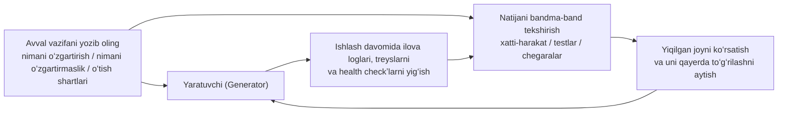

[English version →](../../../en/lectures/lecture-11-why-observability-belongs-inside-the-harness/)

> Ushbu maʼruza uchun kod misollari: [code/](https://github.com/walkinglabs/learn-harness-engineering/blob/main/docs/en/lectures/lecture-11-why-observability-belongs-inside-the-harness/code/)
> Amaliy loyiha: [Loyiha 06. Toʻliq harness (Capstone)](./../../projects/project-06-runtime-observability-and-debugging/index.md)

# 11-maʼruza. Agent runtimeʼini kuzatuvchan qiling

## Ushbu maʼruza qanday muammoni hal qiladi?

Siz agentdan biror funksiyani (feature) yaratishni soʻraysiz. U 20 daqiqa ishlab, bir qancha fayllarni oʻzgartiradi va keyin sizga “tugatildi, lekin ikkita test yiqilyapti” deydi. Nega yiqilayotganini soʻrasangiz — “aniq bilmayman, balki vaqt (timing) bilan bogʻliq muammodir” deydi. U qaysi muhim yoʻllarni (critical paths) oʻzgartirganini soʻrasangiz — “kodga qarab koʻray-chi...” deb javob beradi.

Bu agentning imkoniyati yoʻqligida emas. Bu sizning harnessʼingiz yetarli kuzatuvchanlikni (observability) taʼminlab bermaganidadir. **Kuzatuvchanliksiz, agentlar qarorlarni noaniqlik sharoitida qabul qilishadi, baholashlar (evaluations) shaxsiy taxminlarga aylanadi, va takroriy urinishlar (retries) koʻr-koʻrona sargardonlik boʻlib qoladi.** OpenAI va Anthropic ikkalasi ham ishonchlilik (reliability) ni dalillar (evidence) muammosi sifatida taʼriflaydi — harness runtime xatti-harakatini va baholash signallarini keyingi qarorga yoʻl koʻrsata oladigan shaklda ochib berishi kerak.

## Asosiy tushunchalar

- **Runtime kuzatuvchanligi (Runtime observability)**: Tizim darajasidagi signallar — loglar, treyslar (traces), jarayon hodisalari, health checkʼlar. “Tizim nima qildi” degan savolga javob beradi.
- **Jarayon kuzatuvchanligi (Process observability)**: Harness qarorlariga oid artefaktlarning koʻrinishi — rejalar, baholash rubrikalari (scoring rubrics), qabul qilish mezonlari. “Nega bu oʻzgarish qabul qilinishi kerak” degan savolga javob beradi.
- **Vazifa treysi (Task trace)**: Tarqatilgan tizimlardagi (distributed systems) soʻrovlarni kuzatish (request tracing) kabi, vazifaning boshlanishidan oxirigacha boʻlgan toʻliq qaror yoʻlini qayd etish. Agent qoʻygan har bir qadam oʻz konteksti bilan birga yozib olinadi.
- **Sprint shartnomasi (Sprint contract)**: Kod yozish boshlanishidan oldin kelishib olinadigan qisqa muddatli shartnoma — vazifa koʻlamini (scope), tekshirish standartlarini va istisnolarni aniq koʻrsatib beradi. Jarayon kuzatuvchanligi uchun asosiy vosita.
- **Baholovchi rubrikasi (Evaluator rubric)**: Sifatni baholashni subyektiv hukmdan, dalillarga asoslangan tuzilmali ball qoʻyishga aylantiradi. Turli xil baholovchilar bir xil ish uchun oʻxshash natijalar berishini taʼminlaydi.
- **Qatlamli kuzatuvchanlik (Layered observability)**: Tizim qatlami va jarayon qatlami kuzatuvchanligining birgalikda ishlab chiqilishi va bir-birini toʻldirishi. Runtime signallari nima qilganini tushuntirsa, jarayon artefaktlari nega qilganini (intent) tushuntiradi.

## Qatlamli Kuzatuvchanlik



## Nega bunday boʻladi

### Kuzatuvchanlikning yoʻqligining haqiqiy badali

Harnessʼda kuzatuvchanlik boʻlmasa, tizimli ravishda toʻrt turdagi muammo yuzaga keladi:

**“Toʻgʻri” va “toʻgʻriga oʻxshaydi” ni ajrata olmaslik**: Kodni review (tekshirish) qilganda qandaydir funksiya mutlaqo toʻgʻri koʻrinadi — sintaksis toʻgʻri, mantiq toʻgʻri. Lekin runtimeʼda (ishlayotganda), maʼlum bir holatda (edge case) xatolikni tutishda muammo chiqib, aniq kirish maʼlumotlarida xato natija beradi. Faqatgina runtime treyslarigina amaldagi ishlash yoʻli kutilganidan boshqacha chiqqanini koʻrsatib bera oladi.

**Baholash sehrgarlikka aylanadi**: Baholash rubrikasi va qabul qilish mezonlarisiz, baholovchilar (odam yoki agent) faqat ichki tasavvurlariga suyanishadi. Bitta natija turli baholovchilardan turlicha baho olishi mumkin. Sifat bahosi takrorlanmaydigan boʻlib qoladi.

**Qayta urinishlar (Retries) koʻr-koʻrona taxminga aylanadi**: Qachonki agent biror narsa nega yiqilganini bilmasa, qayta urinish yoʻnalishi mutlaqo tasodifiy boʻladi. U notoʻgʻri yoʻnalishda qayta-qayta urinishi mumkin — xatoning asl sababini eʼtiborsiz qoldirib, unga umuman aloqasi boʻlmagan joylarni tuzatib yotadi. Har bir koʻr-koʻrona urinish token va vaqt sarflaydi.

**Sessiyalararo maʼlumot jarligi (Session handoff information cliff)**: Chala bajarilgan ish keyingi sessiyaga uzatilsa, kuzatuvchanlikning yoʻqligi yangi sessiya tizim holatini boshidan oʻrganishga majbur boʻlishini anglatadi. Anthropicʼning uzoq davom etadigan agentlar boʻyicha kuzatuvlari shuni koʻrsatadiki, bu takroriy oʻrganish (redundant diagnosis) jami sessiya vaqtining 30-50% ini yeb qoʻyishi mumkin.

### Claude Code ishtirokidagi hayotiy vaziyat

Faraz qiling, harness “rejalashtiruvchi-yaratuvchi-baholovchi (planner-generator-evaluator)” uch rollik jarayondan (workflow) foydalanib, “ilovaga qorongʻu rejim (dark mode) ni qoʻshish” vazifasini bajarmoqda.

**Kuzatuvchanliksiz**: Rejalashtiruvchi noaniq tushuntirish beradi. Yaratuvchi qorongʻu rejimni shu noaniqlikka asoslanib bajaradi, biroq u rejalashtiruvchining ichki kutganlariga toʻgʻri kelmaydi. Baholovchi oʻzining yashirin standartlariga asoslanib natijani rad etadi, lekin aynan nima xato ekanini tushuntira olmaydi. Yaratuvchi shu noaniq rad etish sabablariga qarab koʻr-koʻrona qayta urinishlar qiladi. Bu sikl 3-4 marta takrorlanadi, taxminan 45 daqiqa vaqt oladi va zoʻrgʻa qabul qilsa boʻladigan natija beradi.

**Toʻliq kuzatuvchanlik bilan**: Rejalashtiruvchi sprint shartnomasini — qaysi komponentlar oʻzgarishi, har biri uchun tekshirish standartlari va istisnolar (masalan, bosma uchun stillar chiqarilmasin) ni aniq chiqarib beradi. Yaratuvchi xuddi shu shartnoma asosida kod yozadi. Runtime kuzatuvchanligi har bir komponentning stil yuklanishi va qoʻllanish jarayonini qayd etadi. Baholovchi baholash rubrikasidan foydalanib oʻlchamlar boʻyicha baholaydi va aniq dalillarni keltiradi. Bitta iteratsiya (aylanish) yuqori sifatli natija beradi va bor-yoʻgʻi 15 daqiqa oladi.

3 barobar samaradorlik farqi. Yagona farq — kuzatuvchanlikdir.

### Nega agentlar buni oʻzlari yecha olishmaydi

Siz oʻylashingiz mumkin: “Agent shunchaki oʻzi loglarni chiqarib yozib qoldirsa boʻlmaydimi?” Muammolar quyidagicha:

1. Agent oʻzi nimani bilmasligini bilmaydi — u oʻziga kerak boʻladigan signallarni avvaldan (proactively) bilib, yozib qoldirmaydi.
2. Log formatlari har xil — turli sessiyalar har xil log formatlaridan foydalanadi, bu tizimli tahlil qilishni imkonsiz qiladi.
3. Jarayon kuzatuvchanligini loglar bilan hal qilib boʻlmaydi — sprint shartnomalari va baholash rubrikalari harness darajasidagi yordamni talab qiluvchi strukturaviy artefaktlardir.

## Buni qanday qilib toʻgʻri qilish kerak

### 1. Harness ichiga Runtime signallarni yigʻishni oʻrnating

Agent oʻzi log yozib qoldirishiga tayanmang. Harness avtomatik tarzda quyidagi signallarni yigʻib olishi kerak:

- **Ilovaning yashash sikli (Application lifecycle)**: Ishga tushish (startup), tayyor, ishlayapti, oʻchish (shutdown) holatlari.
- **Funksiyaning ishlash yoʻli (Feature path execution)**: Muhim yoʻllarning qanday ishlagani, jumladan, kirish nuqtalari, tekshiruv joylari va chiqish joylari yozuvlari.
- **Maʼlumot oqimi (Data flow)**: Komponentlar orasida uzatilayotgan maʼlumotlar qaydi.
- **Resurslardan foydalanish (Resource utilization)**: Resurslarning gʻayritabiiy ishlatilishi (masalan, xotiraning uzluksiz oʻsishi).
- **Xatolar va istisnolar (Errors and exceptions)**: Shunchaki xato xabari emas, balki toʻliq xato konteksti.

### 2. Sprint shartnomalarini joriy qiling

Har bir vazifa boshlanishidan oldin, yaratuvchi (generator) va baholovchi (evaluator) (ular bir xil agentning har xil chaqiruvlari boʻlishi ham mumkin) oʻzaro shartnoma tuzishadi:

```markdown
# Sprint shartnomasi: Qorongʻu rejimni (Dark Mode) qoʻllab-quvvatlash

## Qamrov (Scope)
- Theme toggle komponentini oʻzgartirish
- Global CSS oʻzgaruvchilarini yangilash
- Qorongʻu rejim uchun testlar qoʻshish

## Tekshiruv standartlari (Verification Standards)
- Har bir komponent uchun vizual regressiya (visual regression) testlari oʻtadi
- Asosiy oqim (main flow) end-to-end testlardan oʻtadi
- Stilsiz kontent koʻrinib qolmasligi (FOUC) shart

## Istisnolar (Exclusions)
- Bosmaga chiqarish (print) stillari qoʻllab-quvvatlanmaydi
- Uchinchi tomon komponentlarining (third-party component) qorongʻu rejimlari ishlanmaydi
```

### 3. Baholovchi rubrikasini oʻrnating (Evaluator Rubric)

“Bu yaxshimi yoki yoʻqmi” degan savolni aniq hisoblanadigan ballarga aylantiring:

```markdown
# Baholash rubrikasi (Scoring Rubric)

| Oʻlcham (Dimension) | A | B | C | D |
|-----------|---|---|---|---|
| Kodning toʻgʻriligi | Barcha testlar oʻtadi | Asosiy oqim oʻtadi | Qisman oʻtadi | Build yiqiladi |
| Arxitekturaga muvofiqlik | Toʻliq mos keladi | Kichik ogʻishlar bor | Yaqqol ogʻishlar bor | Jiddiy qoidabuzilishlar bor |
| Test qamrovi | Asosiy + kutilmagan (edge) holatlar | Faqat asosiy oqim | Faqat test skeleti | Hech qanday test yoʻq |
```

### 4. OpenTelemetry bilan standartlashtirish

Har bir harness sessiyasi uchun bitta treys (trace), har bir vazifa uchun bitta span va har bir tekshirish bosqichi uchun ichki spanʼlar (sub-spans) yarating. Muhim maʼlumotlarni izohlash (annotate) uchun standart atributlardan foydalaning. Shu orqali kuzatuv maʼlumotlari odatiy vositalar (Jaeger, Zipkin) bilan birlashadi.

## Hayotiy misol

Rejalashtiruvchi-yaratuvchi-baholovchi (planner-generator-evaluator) jarayonidan foydalanib “qorongʻu rejim qoʻshish” vazifasini bajaruvchi harness:

**Kuzatuvsiz (Unobservable) versiya**: 3-4 marta koʻr-koʻrona urinish, 45 daqiqa, zoʻrgʻa yaroqli natija. Baholovchi “nimadir xatodek tuyulyapti” deydi, lekin aniq qayerdaligini ayta olmaydi. Yaratuvchi notoʻgʻri yoʻnalishlarda koʻp vaqt yoʻqotadi.

**Toʻliq kuzatiladigan (Fully observable) versiya**:
- Sprint shartnomasi qamrov, standartlar va istisnolarni aniq qilib beradi
- Runtime treyslar har bir komponent uslubi qanday yuklanishini yozib oladi
- Baholash rubrikasi oʻlchamlar boʻyicha tuzilmali baho berish imkoniyatini taqdim etadi
- Bitta aylanishda (iteration) 15 daqiqada yuqori sifatli natija yuzaga keladi

Samaradorlik 3 barobar yaxshilanadi, sifat barqarorlashadi va baholashlar takrorlanuvchan (reproducible) boʻladi.

## Asosiy xulosalar

- **Kuzatuvchanlik — bu harness arxitekturasining oʻziga xos xususiyatidir** — u ish oxirida qoʻshiladigan biror funksiya (feature) emas, u boshidanoq dizaynga qoʻshilishi shart boʻlgan asosiy imkoniyatdir.
- **Ikkala kuzatuv qatlami ham zarur** — runtime signallar “nima boʻlganini” tushuntirsa, jarayon artefaktlari “nima uchun aynan shunday qilinganini” tushuntiradi.
- **Sprint shartnomalari tushunmovchilikni boshidanoq yoʻqotadi** — “yaratuvchi baholovchi koʻriboq rad etadigan narsani yasashini” oldini oladi.
- **Baholash rubrikalari bahoni takrorlanuvchan (reproducible) qiladi** — turli xil baholovchilar ayni bitta natija uchun bir xil baho berishini taʼminlaydi.
- **Kuzatuvchanliksiz sessiya vaqtining 30-50% qismi ortiqcha narsalarni takror oʻrganishga sarflanadi.**

## Qoʻshimcha oʻqish uchun

- [Observability Engineering - Charity Majors](https://www.honeycomb.io/blog/observability-engineering-book) — Zamonaviy kuzatuv muhandisligining nazariy va amaliy asosi
- [Dapper - Google (Sigelman et al.)](https://research.google/pubs/pub36356/) — Keng miqyosli tarqatilgan treyslar (distributed tracing) boʻyicha yutuq
- [Harness Design - Anthropic](https://www.anthropic.com/engineering/harness-design-long-running-apps) — Sprint shartnomalari va baholash rubrikalarini kiritish haqida
- [Site Reliability Engineering - Google](https://sre.google/sre-book/table-of-contents/) — Ishlab chiqarish tizimlarida (production systems) kuzatuvchanlikni tizimli qoʻllash

## Mashqlar

1. **Kuzatuvdagi boʻshliq tahlili (Observability Gap Analysis)**: Joriy harnessʼingizning tizim qatlami va jarayon qatlamidagi kuzatuvchanlik imkoniyatlarini tekshirib chiqing. Mavjud signallar orqali ajratib boʻlmaydigan tizim holatlarini aniqlang va yechimlar taklif qiling.

2. **Sprint shartnomasi amaliyoti**: Haqiqiy vazifa uchun sprint shartnomasini yozing. Agentga shartnoma asosida ishlashni buyuring va shartnoma bilan, shartnomasiz qilingan ishning sifati hamda samaradorligini solishtiring.

3. **Vazifa treysini yaratish (Task Trace Construction)**: Agentning toʻliq kod yozish vazifasidagi har bir qadamini yozib oling. OpenTelemetry semantik anʼanalari bilan izohlang (annotate). Treysdagi maʼlumot toʻsiqlarini (information bottlenecks) tahlil qiling — qaysi qadamlarda agent yetarli signalga ega emasligini aniqlang.
