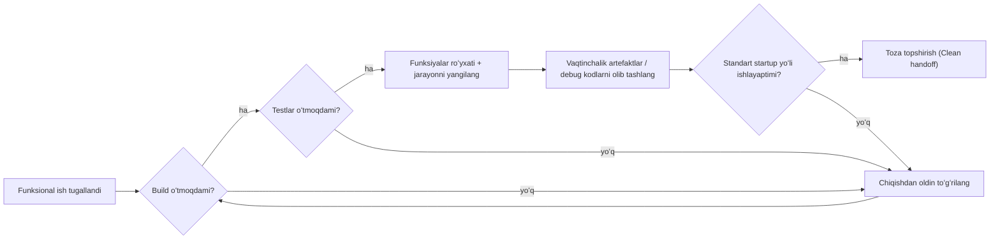
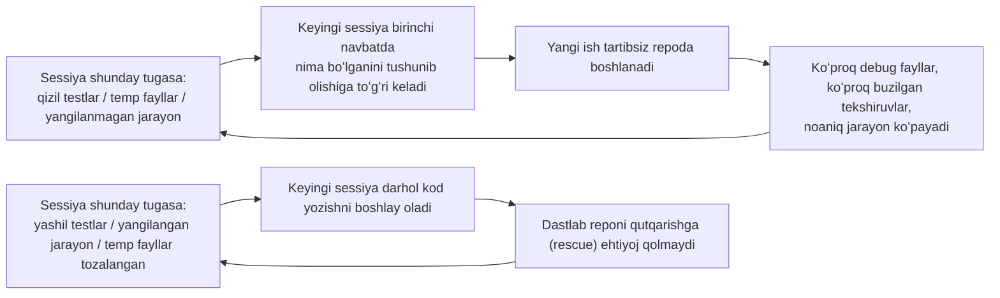

[English version →](../../../en/lectures/lecture-12-why-every-session-must-leave-a-clean-state/)

> Ushbu maʼruza uchun kod misollari: [code/](https://github.com/walkinglabs/learn-harness-engineering/blob/main/docs/en/lectures/lecture-12-why-every-session-must-leave-a-clean-state/code/)
> Amaliy loyiha: [Loyiha 06. Toʻliq harness (Capstone)](./../../projects/project-06-runtime-observability-and-debugging/index.md)

# 12-maʼruza. Har bir sessiya oxirida toza holat topshiring

## Ushbu maʼruza qanday muammoni hal qiladi?

Sizning agentingiz tushdan keyin ishlaydi, 20 ta faylni oʻzgartiradi, kodni commit qiladi va sessiya tugaydi. Keyingi agent sessiyasi ish boshlaydi va birdan shularni aniqlaydi: build yiqilyapti (broken), testlar qizil (yiqilgan), vaqtinchalik debug fayllar sochilib yotibdi, funksiyalar roʻyxati yangilanmagan va ishlarning qay holatdaligi butunlay noaniq. Yangi sessiya birinchi 30 daqiqasini faqatgina “oʻtgan sessiya oʻzi nima qilgandi” degan narsani tushunishga sarflaydi.

OpenAI ham, Anthropic ham buni ochiqchasiga aytadi: **uzoq muddatli ishonchlilik faqatgina bir martalik ishning muvaffaqiyatiga emas, balki operatsion tartib-intizomga bogʻliqdir.** Sessiya yakunidagi holat (state) sifati bevosita keyingi sessiyaning samaradorligini belgilaydi. Buni Gitʼning eng yaxshi amaliyotlari kabi tasavvur qiling — har bir commit yaxlit, kompilyatsiya qilinadigan oʻzgarish boʻlishi kerak, chala yozilgan kodlar yigʻindisi emas.

## Asosiy tushunchalar

- **Toza holat (Clean state)**: Tizim sessiya oxirida beshta shartni qanoatlantirishi kerak — build oʻtadi, testlar oʻtadi, bajarilgan jarayon qayd etilgan, eskirgan artefaktlar qolmagan, ishga tushirish (startup) yoʻli ochiq. Ulardan birortasi boʻlmasa, sessiya “tugatildi” hisoblanmaydi.
- **Sessiya yaxlitligi (Session integrity)**: Maʼlumotlar bazasi tranzaksiyalariga oʻxshaydi — yo oʻzgarishni toʻliq saqlang (commit) va toza holat qoldiring, yoki oxirgi muvofiq holatga (consistent state) qayting (roll back). Boshqa chorasi yoʻq.
- **Sifat hujjati (Quality document)**: Har bir modulning sifat reytingini doimiy ravishda qayd etib boruvchi faol artefakt. Bu bir martalik baholash emas, balki kod bazasining (codebase) vaqt oʻtishi bilan kuchayib borayotgani yoki zaiflashayotganini koʻrsatuvchi trekkerdir.
- **Tozalash sikli (Cleanup loop)**: Kod bazasidagi entropiyani tizimli ravishda kamaytirishga qaratilgan muntazam texnik xizmat koʻrsatish sessiyasi. Favqulodda yamoq qoʻyish emas, balki odatiy operatsiyalar (routine operations).
- **Harnessni soddalashtirish (Harness simplification)**: Model qobiliyatlari oshgani sari, endi keragi yoʻq boʻlgan harness komponentlarini davriy ravishda olib tashlash. Bugun muhim boʻlgan cheklov uch oydan soʻng ortiqcha yukka aylanishi mumkin.
- **Idempotent tozalash (Idempotent cleanup)**: Tozalash operatsiyalari necha marta ishga tushishidan qatʼi nazar, bir xil natija berishi kerak. Bu xatolik/qayta urinish (failure-retry) ssenariylarida ham tozalashning xavfsiz boʻlib qolishini taʼminlaydi.

## Toza holatning besh oʻlchami





## Nega bunday boʻladi

### Entropiyaning oʻsishi bu standart holatdir

Dasturiy taʼminot evolyutsiyasining Leman qonunlariga (Lehmanʼs laws) koʻra: doimiy oʻzgarishdagi tizimlarning murakkabligi faol boshqarilmas ekan, u muqarrar ravishda oshib boraveradi. Bu ayniqsa AI kod yozish agentlari uchun toʻgʻri — har bir sessiya oʻzgarishlar olib kiradi va chiqishda tozalab ketilmasa, texnik qarz (technical debt) eksponensial tarzda koʻpayib boradi.

Haqiqiy maʼlumotlar soʻzlaydi. Hech qanday tozalash strategiyasisiz agentlar bilan 12 hafta davomida ishlab chiqilgan loyiha:

- 1-hafta: Build oʻtish darajasi 100%, testlar oʻtish darajasi 100%, yangi sessiyani boshlash 5 daq
- 4-hafta: Build 95%, testlar 92%, boshlash 15 daq
- 8-hafta: Build 82%, testlar 78%, boshlash 35 daq
- 12-hafta: Build 68%, testlar 61%, boshlash 60+ daq

Xuddi shu loyiha tozalash strategiyasi bilan:

- 1-hafta: 100%, 100%, 5 daq
- 12-hafta: 97%, 95%, 9 daq

12 haftadan soʻng: build oʻtish darajasi oʻrtasida 29 foiz punkti farq, yangi sessiyani boshlash vaqti oʻrtasida esa 85% farq bor. Bu faqat nazariya emas — bu kuzatilgan aniq farqdir.

### Toza holatning besh oʻlchami

Toza holat bu shunchaki “kod kompilyatsiya boʻladi” degani emas. U beshta oʻlchamni birgalikda baholaydi:

**Build oʻlchami**: Kod xatosiz build boʻladimi? Bu eng asosiysi — keyingi sessiya ishni build xatolarini tuzatishdan boshlamasligi kerak.

**Test oʻlchami**: Barcha testlar oʻtmoqdami? Sessiyadan oldin mavjud boʻlgan testlar ham — bu sessiya mavjud funksiyani (functionality) buzmaslikka masʼuldir. Va u faqat “mening kompyuterimda ishlayapti” boʻlib qolmay, CIʼda ham tekshirilishi shart.

**Jarayon (Progress) oʻlchami**: Joriy ishning jarayoni mashina oʻqiy oladigan artefaktga yozilganmi? Oʻzining qabul qilish shartlariga (passing criteria) ega tugatilgan sub-vazifalar, jarayonda boʻlgan lekin tugallanmaganlarining joriy holati va hali boshlanmaganlari kiritilishi kerak. Yaxshi jarayon qaydlari yangi sessiya ishga tushgandagi diagnostika vaqtini 60-80% gacha kamaytiradi.

**Artefakt oʻlchami**: Eskirgan yoki noaniq vaqtinchalik artefaktlar qolmadimi? Debug loglari, vaqtinchalik fayllar, izoh qilib qoldirilgan kodlar (commented-out code), TODO eslatmalari — bularning barchasi keyingi sessiya uchun bilish kerak boʻlgan kognitiv yukni (cognitive load) oshiradi.

**Startup oʻlchami**: Standart ishga tushirish (startup) yoʻli ochiqmi? Keyingi sessiya inson aralashuvisiz ishni boshlay oladimi? Muhitni ishga tushirish, kod bazasini yuklash, kontekstni tushunib olish, vazifani tanlash — bu yoʻllar buzilgan boʻlmasligi kerak.

### “Keyinroq tozalab qoʻyaman” degani — hech qachon tozalab qoʻymayman degani

Eng koʻp tushiladigan aqliy tuzoq bu “bu sessiyada tozalashga vaqtim yoʻq, keyingi safar tozalayman” deyishdir. Ammo keyingi agent sessiyasi sizning ortda nima tashlab ketganingizni bilmaydi — u faqat tartibsiz kod va noaniq holatni koʻradi. U “bu kodning qaysi qismlari ataylab yozilgan va qaysi qismlari vaqtinchalik” deganini aniqlashga ancha vaqt sarflaydi.

Eng yomoni, har bir sessiyaning oʻz vazifasi (task objectives) bor. Yangi sessiya oldingi sessiyaning chala ishlari va tartibsizliklarini tozalash uchun emas, yangi ish qilish uchun kelgan. U bu tartibsizlikka eʼtibor bermay, uning ustiga yangi ishini boshlaydi, tartibsizlik ustiga yana tartibsizlik qoʻshadi. Bu entropiyaning ijobiy qayta aloqa siklidir (positive feedback loop).

## Buni qanday qilib toʻgʻri qilish kerak

### 1. Toza holatni yakunlash talabi sifatida qoʻyish

Harnessʼda buni aniq belgilang: **sessiyani yakunlash = vazifa tekshiruvdan oʻtdi (passes verification) VA toza holat tekshiruvidan (clean state check) oʻtdi.** Bulardan birortasini bajarmaslik, sessiya tugallanmadi deganidir. CLAUDE.md fayliga shunday yozing:

```
## Sessiyadan chiqish tekshiruvi (Session Exit Checklist)
- [ ] Build oʻtadi (npm run build)
- [ ] Barcha testlar oʻtadi (npm test)
- [ ] Funksiyalar roʻyxati yangilangan
- [ ] Debug kodlari qolmagan (console.log, debugger, TODO)
- [ ] Standart ishga tushirish (startup) yoʻli ochiq (npm run dev)
```

### 2. Ikki rejimli tozalash strategiyasi (Dual-Mode Cleanup Strategy)

Ikkita tozalash rejimini birlashtiring:

**Zudlik bilan tozalash (Immediate cleanup - har bir sessiya oxirida)**: Sessiya davomida yaratilgan vaqtinchalik artefaktlarni tozalash, funksiyalar roʻyxati holatini yangilash, build va testlar oʻtishini taʼminlash. Bu “havolalarni hisoblash” (reference counting) kabi tozalashdir.

**Vaqti-vaqti bilan tozalash (Periodic cleanup - haftalik)**: Tizimni toʻliq skanerdan oʻtkazish — toʻplanib qolgan strukturaviy muammolarni hal qilish, sifat hujjatlarini yangilash, qoidadan ogʻishlarni (drift) aniqlash uchun benchmark testlarini oʻtkazish. Bu “treysing” (tracing) kabi tozalashdir.

### 3. Sifat hujjatini (Quality Document) olib boring

Sifat hujjati har bir modulni doimiy ravishda baholab boradigan faol artefaktdir:

```markdown
# Sifat Hujjati

## Foydalanuvchi Autentifikatsiya Moduli (Sifat: A)
- Tekshiruvdan oʻtdi: Ha
- Agent tushuna oladi: Ha
- Test barqarorligi: Barqaror
- Arxitektura chegaralari: Qoidaga mos
- Kod konvensiyalari: Amal qilingan

## Toʻlov Moduli (Sifat: C)
- Tekshiruvdan oʻtdi: Qisman (toʻlov call-backʼi sinovdan oʻtmagan)
- Agent tushuna oladi: Qiyin (mantiq 3 ta faylga sochilib ketgan)
- Test barqarorligi: Barqaror emas (2 ta beqaror (flaky) test)
- Arxitektura chegaralari: Qoidabuzilishlar mavjud
- Kod konvensiyalari: Qisman amal qilingan
```

Yangi sessiyalar ushbu hujjatni oʻqib chiqib, ustuvorlik nimaga qaratilishini darhol bilib oladi. Eng avvalo eng past ball olgan modulni toʻgʻrilang.

### 4. Vaqti-vaqti bilan Harnessʼni soddalashtiring

Anthropicʼdan muhim tushuncha: **har bir harness komponenti agent biror ishni mustaqil va ishonchli bajara olmagani uchungina mavjuddir. Ammo modellar takomillashgani sari, bu taxminlar oʻz eskiradi.** Uch oy oldin zarur boʻlgan cheklov, bugun shunchaki ortiqcha yukka aylanishi mumkin.

Tavsiya etiladigan amaliyot: Har oyda bitta harness komponentini tanlang, uni vaqtinchalik oʻchirib qoʻying va benchmark testlarini oʻtkazing. Agar natijalar yomonlashmasa, uni butunlay olib tashlang. Agar yomonlashsa, uni qaytadan yoqing yoki yengilroq alternativa bilan almashtiring.

### 5. Tozalash operatsiyalari Idempotent boʻlishi kerak

Tozalash skriptlari necha marta qayta-qayta ishga tushirilmasin doim xavfsiz boʻlishi kerak:

```bash
# Idempotent tozalash amallari
rm -f /tmp/debug-*.log  # -f fayllar mavjud boʻlmasa ham xato bermasligini taʼminlaydi
git checkout -- .env.local  # Maʼlum boʻlgan barqaror holatga (known state) qaytarish
npm run test  # Tozalash hech narsani buzmaganini tasdiqlash
```

## Hayotiy misol

Ikkita yondashuv bilan 12 hafta davomida agentlar yordamida ishlab chiqilgan Electron ilovasi (app):

**Tozalash strategiyasisiz** (nazorat guruhi - control group): 12-haftada, build oʻtish darajasi 68%, test oʻtish darajasi 61%, yangi sessiyani boshlash vaqti 60+ daq, eskirgan artefaktlar 103 ta.

**Tozalash strategiyasi bilan** (tajriba guruhi - experimental group): Har bir sessiya yakunida toʻliq toza-holat tekshiruvi (clean-state check) + haftalik tozalash sikli (weekly cleanup loop). 12-haftada, build oʻtish darajasi 97%, test oʻtish darajasi 95%, yangi sessiyani boshlash vaqti 9 daq, eskirgan artefaktlar 11 ta.

12-haftaga kelib, tajriba guruhining build oʻtish darajasi 29 foiz punkti yuqori, test oʻtish darajasi 34 foiz punkti yuqori va yangi sessiyani boshlash vaqti 85% ga qisqa.

## Asosiy xulosalar

- **Toza holat — bu sessiyani tugatish uchun muhim va zarur shartdir** — bu ixtiyoriy “uy tozalash” (housekeeping) ishi emas, balki “bajarilganlik mezonlari (definition of done)”ning bir qismidir.
- **Barcha besh oʻlcham talab qilinadi** — build, testlar, jarayon (progress), artefaktlar, ishga tushirish (startup) — har biri alohida ochiq holda tekshirilishi kerak.
- **Sifat hujjatlari orqali kod bazasining salomatligini kuzatish imkoni tugʻiladi** — siz faqat aynan nima yomonlashayotganini bilsangizgina uni tuzata olasiz.
- **Harnessʼni vaqti-vaqti bilan soddalashtiring** — model qobiliyatlari yaxshilanib borgani sari, keraksiz cheklovlarni olib tashlang.
- **“Keyinroq tozalab qoʻyaman” = Hech qachon tozalab qoʻymayman degani** — entropiyaning oʻsishi standart jarayondir; faqat faol tozalash qilinishigina unga qarshi tura oladi.

## Qoʻshimcha oʻqish uchun

- [Clean Code - Robert C. Martin](https://www.goodreads.com/book/show/3735293-clean-code) — Kodni toza saqlash boʻyicha tizimli tamoyillar
- [Harness Engineering - OpenAI](https://openai.com/index/harness-engineering/) — Qayta ishlab chiqaruvchanlik (Reproducibility) harness dizaynining asosiy talablaridan biri sifatida
- [Effective Harnesses - Anthropic](https://www.anthropic.com/engineering/effective-harnesses-for-long-running-agents) — Uzoq muddatli ishonchlilik uchun toza sessiya yakunlarining hal qiluvchi roli
- [Programs, Life Cycles, and Laws of Software Evolution - Lehman](https://ieeexplore.ieee.org/document/1702314) — Tizim murakkabligining faol kuzatuvsiz (active maintenance) muqarrar ravishda oʻsishini isbotlovchi dastur evolyutsiyasi qonunlari

## Mashqlar

1. **Toza Holat (Clean State) Tekshiruv roʻyxati**: Barcha besh oʻlchamni oʻz ichiga oladigan kod bazangiz uchun sessiyadan chiqish tekshiruvi roʻyxatini loyihalang. Buni ketma-ket 5 ta sessiya davomida qoʻllang va har bir oʻlcham boʻyicha buzilishlarni qayd qilib boring.

2. **Benchmark Taqqoslash**: Bir xil vazifalar roʻyxatini 2 ta turli harness variantida (toza holat talablari bor/yoʻq boʻlgan holda) foydalaning. Tugallanish darajasini, takroriy urinishlar sonini (retry count) va xatoliklar chetlab oʻtish darajasini (defect escape rate) solishtiring.

3. **Harnessni Soddalashtirish Amaliyoti**: Bitta harness komponentini tanlang, uni vaqtinchalik oʻchirib qoʻying va benchmark vazifalarini ishlating. Uni bor va yoʻq boʻlgan holatdagi natijalarni solishtiring. Qoldirishni, olib tashlashni yoki almashtirishni hal qiling.
